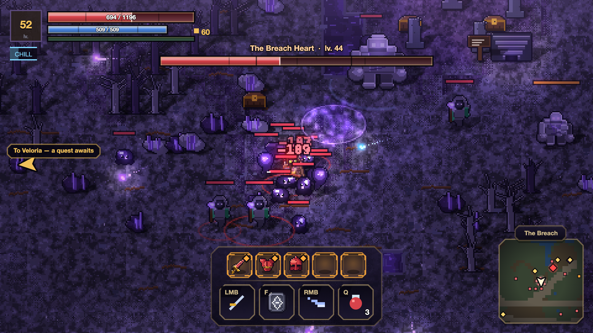
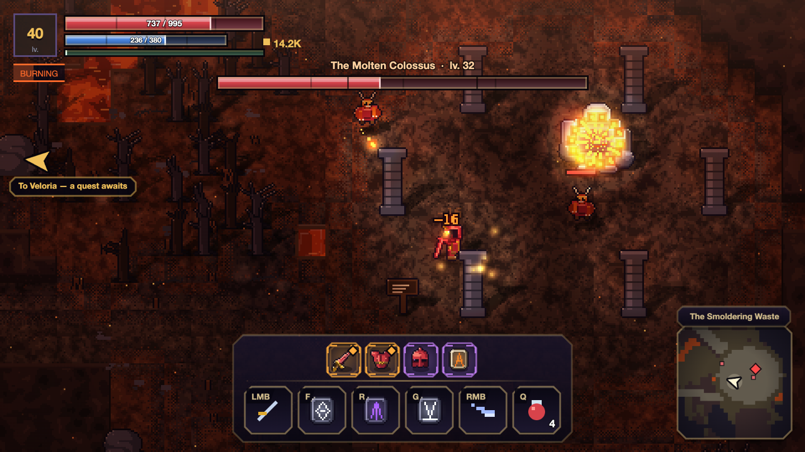
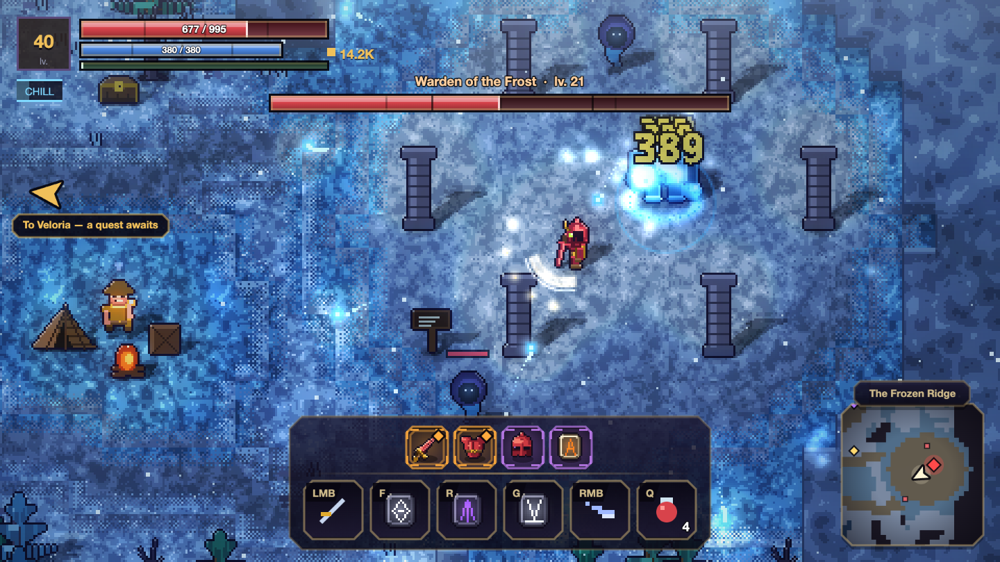

<div align="center">

# VELORIA

### No engine. No assets. No build step.

**A 2D pixel-art ARPG that forges itself at load —
every sprite, every shadow, every note of music written in code.**

*by [therealden4700](https://github.com/therealden4700)*

</div>



> **The Breach Heart** — the act three boss. The rings on the ground are void
> vents: you cannot fight inside one, you can cross it, and a dash carries you
> through for free.

| | |
|---|---|
|  |  |
| **The Molten Colossus** · The Smoldering Waste | **Warden of the Frost** · The Frozen Ridge |

---

## What it is

A full action RPG that runs in a browser tab. A hub city, **five biomes** with
their own bosses, an **endless dungeon** that gets more hostile the deeper you
go, **three acts** of story to level 52, guild contracts, a forge, elemental
reactions, skill runes, set bonuses and legendary properties that change how you
play rather than how much you hit for.

## What makes it unusual

**Nothing is imported.** There is no engine, no sprite sheet, no audio file, no
font file, no npm install and no build step. Every tile, monster, item icon,
letter, sound effect and piece of music is **generated in code while the game
loads** — from a handful of colour ramps and parameters. The whole project has
exactly one external asset: `assets/title.png`, the title screen.

That is not a stunt. A monster is a line of configuration, so adding one costs a
line. A biome is a palette plus a list, so a new one is an afternoon. The whole
game is 480×270 pixels upscaled with hard edges, with a second canvas on top
carrying the interface at native resolution — pixels stay square, text stays
sharp.

**Every number is proved, not guessed.** In `tools/` there are headless stands
that import the real game and run the real rules with no screen: combat, loot,
zones, the descent, saves, and a long soak run that plays the game to itself.
They do not simulate the rules — they *are* the rules, shared with the game
through `src/systems/`. When a weapon drifts, a boss turns into a sponge or a
build becomes a trap, the stand says so with a number.

Five separate times this project a finding turned out to be in the measuring
apparatus rather than in the game. Each of those is written down too.

## Run it

```bash
node server/server.js
```

Then open <http://localhost:8123>. **Node 22.5 or newer** and nothing else —
there is nothing to install, but the server stores characters through the
built-in `node:sqlite`, which older releases do not have. One process serves the
files, runs the co-op room and keeps the save; the database creates itself on
first launch.

For single player alone, any static server will do (`python3 serve.py` is
included, and it needs no Node at all). It will not run from `file://` — the
game is built on ES modules.

**Controls.** `WASD` to move, `LMB` or `Space` to attack, `RMB` and `F`/`R`/`G`
for skills, `Shift` to dash, `Q` for a potion, `E` to interact. `I` inventory,
`C` character, `U` quests, `M` map, `Esc` menu, `F3` frame profiler.

## What's in the box

| | |
|---|---|
| **Biomes** | Emerald Forest · Ashen Mire · Frozen Ridge · Smoldering Waste · The Breach |
| **Endgame** | an endless dungeon where depth adds corruption, not just bigger numbers |
| **Story** | three acts, 34 quests, levels 1 → 52 |
| **Combat** | light/heavy combos, shields you must flank, dodges you must break, terrain that hurts |
| **Elements** | four marks that react with each other — corrosion, conduction, steam, shatter |
| **Gear** | rarities, affixes, set bonuses, 22 legendary properties, skill runes you fuse |
| **Forge** | crafting, reforging, salvage, and sharpening that can destroy the weapon |
| **Languages** | Russian and English, switchable in settings |
| **Multiplayer** | a room server on Node built-ins; the server simulates, the client predicts |

## The README below is a work journal

Everything under here is in Russian and it is not documentation — it is the
record of the work: what was measured, what it showed, what was built as a
result and why it was built that way. Including the mistakes, kept in place
because the reasoning is the point.

---

2D-пиксельная ARPG в браузере: город-хаб, пять биомов, бесконечное подземелье,
квесты, лут, прокачка. Вся графика, звук и музыка генерируются кодом при
загрузке — единственный внешний файл во всём проекте — `assets/title.png`,
заставка главного экрана.

Заставка лежит ровно в 480×270, во внутреннем разрешении игры: рисуется один к
одному, без сглаживания, и увеличивается вместе со всем кадром той же лестницей
пикселей. Хранить её крупнее незачем — канвас всё равно 480 пикселей шириной, а
так она весит 265 КБ вместо двух с половиной мегабайт. Грузится параллельно
запеканию спрайтов, так что на время загрузки не влияет (замер: 3 мс из 98).
Если файл пропадёт, титульный экран нарисует прежний фон со звёздами и силуэтом
города — игра не должна падать из-за картинки.

## Запуск

```bash
node server/server.js
```

Открыть http://localhost:8123. Порт задаётся переменной: `PORT=9000 node server/server.js`.

Нужен **Node 22.5 или новее** — и больше ничего: зависимостей у проекта нет,
сервер собран на встроенных модулях `node:`. Граница именно такая из-за
`node:sqlite`, на котором лежит хранилище персонажей: в более старых выпусках
его просто нет. Сервер же раздаёт файлы и держит комнату для совместной игры.
База создаётся сама при первом запуске.

Если нужна только одиночная игра, хватит любого статического сервера — в
комплекте лежит `python3 serve.py`. С `file://` не заработает: игра собрана на
ES-модулях.

## Управление

| Действие | Клавиши |
|---|---|
| Движение | `W A S D` / стрелки |
| Удар | `ЛКМ` или `Пробел` |
| Умения (три слота рун) | `F` / `R` / `G` (или `1` `2` `3`) |
| Рывок (неуязвимость) | `ПКМ` или `Shift` |
| Выпить зелье | `Q` |
| Взаимодействие | `E` |
| Инвентарь / Герой / Задания / Карта | `I` / `C` / `U` / `M` |
| Выбросить предмет | `ПКМ` по нему в рюкзаке (с подтверждением) |
| Стихии (схема реакций) / Записи | вкладки в журнале |
| Пауза | `Esc` |
| Настройки | пункт на главном экране и в паузе |
| Во весь экран | `F11` или кнопка в настройках |

Звук и экран живут в одной панели «Настройки», которая открывается и с главного
экрана, и из паузы, и возвращает туда, откуда её позвали. В паузе они раньше
были двумя строками-переключателями и занимали столько же места, сколько
«Сохранить» и «Выйти», хотя трогают их заметно реже.

Панель ходится и мышью, и клавишами — в паузу заходят с клавиатуры, и потерять
это при переезде было бы не переносом, а поломкой: `↑` `↓` выбирают строку,
`← →` крутят громкость шагом 5%, `Enter` жмёт, `Esc` возвращает.

Настройки лежат в `localStorage` **отдельно от сохранения**: громкость
принадлежит человеку, а не персонажу, и «Новая игра» её не сбрасывает.
Выключатель звука и ползунок — разные вещи: снять глушение возвращает
выставленную громкость, а не единицу, и наоборот — сдвиг ползунка с нуля сам
снимает глушение, иначе игрок тянет ползунок, ничего не слышит и решает, что
звук сломан.

Направление удара — по курсору мыши. Если двигаться только клавиатурой,
герой бьёт туда, куда идёт.

## Что есть в игре

Продать вещь можно только у торговца — не из рюкзака посреди подземелья.
Выбросить — правым кликом по предмету, с подтверждением: выброшенное пропадает
насовсем, потому что подбор магнитит лут в радиусе 46 пикселей и брошенное
вернулось бы в рюкзак через полсекунды.

**Велория** — безопасный город. Кузнец (торговля оружием плюс кузня: ковка,
заточка, переплавка, разбор), оружейница (доспехи, шлемы, украшения), алхимик
(зелья, свитки возврата), рунная ткачиха (руны умений и слияние трёх одинаковых
в одну рангом выше), наставник (вложить очки развития, сброс за 200 золота),
капитан гильдии (задания), хранитель врат (быстрое перемещение по открытым биомам).

**Биомы** открываются по уровню и отличаются мобами, погодой и светом:

| Биом | Уровень | Босс |
|---|---|---|
| Изумрудный лес | 1–6 | Древень Корнегрив |
| Пепельная топь | 6–13 | Тинная Карга |
| Мёрзлый кряж | 13–21 | Хранитель Стужи |
| Тлеющая пустошь | 21–32 | Расплавленный Колосс |
| Пролом | 40–52 | Сердце Пролома |

В каждом биоме: портал домой, костёр, сундуки, арена с боссом, вход в катакомбы
и **три точки интереса** из четырёх возможных — древние руины с обелиском,
дающим благословение на 90 секунд; разбойничий лагерь, который оживает засадой,
когда подходишь; логово вожака с элитой под аффиксом и богатым сундуком;
стоянка бродячего торговца с редким товаром.

**Враги ходят отрядами**, а не поштучно: щитоносец впереди, стрелки сзади, шаман
в тылу. Заметил один — поднимается весь отряд. Восемь шаблонов: дозор, застава,
ватага, свора, ковен, мины, громилы, одиночка.

## Игра объясняет себя сама

Туториала в начале нет намеренно: вывалить на игрока тринадцать умений, четыре
стихийные реакции, вехи заточки и порчу Бездны в первую минуту — значит не
объяснить ничего. Вместо этого каждая система объясняется **в тот момент, когда
впервые становится нужной**, ровно один раз, и запоминается в сохранении.

Восемнадцать таких моментов: первая связка ударов, первая руна, первая
пассивка, первый щитоносец, первая метка на враге, первая сработавшая реакция,
первая элита с аффиксом, первый заход в кузню, первая заточка и её вехи, первый
собранный комплект, первая легендарка, двери подземелья, проклятый алтарь, вход
в Бездну, рекорд глубины.

Карточка **выезжает сбоку и не блокирует ничего** — ни бой, ни управление, ни
меню. Модальное окно посреди схватки было бы худшим способом что-то объяснить.
Живёт девять секунд, уходит сама, убирается по Esc или клику; если сработало
несколько разом — встают в очередь и показываются по одной.

Всё показанное копится во вкладке **«Записи»** журнала: объяснение, промелькнувшее
в бою, иначе терялось бы навсегда.

## Бездна

За 25-м этажом катакомбы становятся **Бездной**. Поводом была не нехватка
контента: симуляция показала, что глубина не ломалась, а **провисала**. На сотом
этаже герой убивал рядового моба за 12,8 удара, а сам умирал за 18,5 — бои
растягивались, опасность не росла. Классическая инфляция чисел.

Поэтому **Порча** бьёт не по здоровью мобов (это дало бы ещё более длинные бои),
а по запасу прочности героя. Она растёт с глубиной, не снимается и не выбирается:

| | эффект |
|---|---|
| Здоровье героя | до −50% |
| Урон врагов | до +100% |
| Скорость врагов | до +40% |
| Добыча и опыт | до +360% / +280% |

Здоровье мобов при этом растёт втрое медленнее прежнего. Что получилось
(герой 40-го уровня в легендарках 6-го ранга — потолок снаряжения):

| этаж | порча | ударов до смерти героя | убить моба |
|---|---|---|---|
| 20 | — | 18,7 | 0,9 с |
| 26 | 1 | 15,2 | 1,5 с |
| 35 | 10 | 9,5 | 1,6 с |
| 45 | 20 | 6,3 | 1,8 с |
| 55 | 30 | 4,4 | 2,2 с |
| 65 | 40 | 2,8 | 2,1 с |
| 100 | 40 | 2,1 | 3,1 с |

Кривая выполаживается, а не уходит в ноль: иначе глубина упиралась бы в стену
«убивают с одного удара». Обычные катакомбы до 25-го этажа не тронуты.

Третьим рычагом напрашивалась броня, но замер показал, что снижение урона у героя
и так держится около 50% и в потолок 82% не упирается — пробивать было нечего.
Убран как рычаг, который ничего не делает, но усложняет модель.

**Чем глубже, тем чище добыча.** Порог редкости растёт с порчей: на 40-м этаже
обычные вещи уже не падают, на 62-м — только эпические и легендарные. Оттуда же
**Слеза Бездны** и три уникальных свойства, которых нет больше нигде — ни в
таблице дропа, ни в заточке на +7: **Полое сердце** (порча отнимает вдвое меньше
здоровья), **Ненасытный** (каждое убийство +2% урона до конца этажа),
**Взгляд Бездны** (пропущенный удар с шансом 25% вешает на бьющего все четыре
метки разом).

На боссовых этажах Бездны **стражи чередуются** — Пасть Пустоты, Полый
Государь, Тлеющая Вдова, Корневой Страж и Лич: двадцать шесть боссовых этажей
подряд с одним и тем же боем ладдером не были бы.

Рекорд глубины хранится отдельно от сохранения — новая игра его не стирает,
иначе ладдер обнулялся бы вместе с персонажем.

**Катакомбы — забег, а не коридор.** Перед каждым спуском выбор из двух дверей с
модификаторами этажа: полчище, исступление, укрепление, мгла, голод, алчность,
хрупкость, травля, щедрость, затишье. Риск повышает добычу и опыт до +90%.
На этажах попадаются проклятые алтари: шесть сделок, где всегда что-то отдаёшь —
пятую часть здоровья за треть урона, половину золота за редкий предмет, третий
слот умения за +60% опыта. Дары держатся до выхода на поверхность. Чем глубже,
тем чаще у мобов аффиксы: стремительный, бронированный, пылающий, вампирский,
исполинский, призрачный. Каждый пятый этаж — босс, и пока он жив, спуск закрыт.

**Умения — руны, а не классы.** Тринадцать активных (вихрь, раскол, сотрясение с
оглушением, теневой рывок, пронзание, аркановый залп, ливень стрел, цепная молния,
стена огня, ледяная новая, ядовитое облако, исцеление, барьер) и тринадцать
пассивных. Три активных слота плюс один пассивный, оружие ни на что не влияет.
Редкость руны усиливает эффект и укорачивает откат; три одинаковых сплавляются
в одну рангом выше.

## Стихии работают друг с другом

Поджиг, яд и замедление раньше были параллельными таймерами: каждый сам по себе,
ни один не знал про остальные. Теперь это **метки** — общая валюта, — и встреча
двух меток даёт третий эффект. Вторая метка не копится поверх первой: они
схлопываются в реакцию.

| Метки | Реакция | Что даёт | Зачем |
|---|---|---|---|
| огонь + яд | **Разъедание** | сильный DoT и −30% защиты на 6 сек | урон по одиночной цели |
| разряд + лёд | **Проводимость** | разряд по трём соседям, метка передаётся | толпа |
| огонь + лёд | **Пар** | облако: враги внутри не стреляют и не колдуют | защита от стрелков |
| тяжёлый удар + лёд | **Раскол** | удар по обмороженному бьёт вдвое сильнее | бурст |

У каждой реакции своя роль, иначе выбор между ними был бы косметическим. Разряд
сам по себе добавляет цели +22% получаемого урона, разъедание — ещё +30%.

Метки видно над врагом иконками, у реакции своё имя, цвет и вспышка. Схема целиком
лежит во вкладке **«Стихии»** в журнале — иначе систему невозможно открыть самому.

**Реакция на цели имеет внутренний откат 1,2 секунды.** Без него две стихии на
оружии давали бы реакцию каждым ударом — по 3–5 за убийство, — и связка перестала
бы быть решением игрока, превратившись в пассивный множитель урона.

Пять пассивных рун читают состояние цели, превращая сбор снаряжения в сборку
билда: **Пирокинез** (+35% урона по горящим), **Ледяное сердце** (+25% крита по
обмороженным), **Токсиколог** (яд тикает на 80% чаще), **Катализатор** (реакции
на 60% сильнее), **Резонанс** (каждая реакция срезает 1,2 сек с откатов).
Четыре легендарных свойства завязаны на ту же систему: **Клеймо стужи** вешает
обморожение каждым ударом (раскол и пар без ледяных рун), **Ледолом** удваивает
раскол, **Громоотвод** добавляет цепи три цели, **Пепельный мор** поджигает всех
вокруг умершего горящего врага.

**Враги требуют разной игры.** Щитоносцы держат фронт и доворачивают щит с
задержкой — заходи сбоку или ломай третьим ударом связки. Латники вдобавок режут
лёгкие удары. Подрывники раздуваются и взрываются. Шаманы лечат союзников лучом —
их убивают первыми. Стрелки и заклинатели заставляют сближаться.

**Прогрессия** — 4 характеристики (Сила, Выносливость, Ловкость, Разум), по 3 очка
за уровень. Пять слотов снаряжения, пять степеней редкости, аффиксы с
масштабируемыми бонусами (вампиризм, поджиг, яд, замедление, крит).

**Легендарки — это свойства, а не числа**: Громобой бьёт цепной молнией каждый
третий удар, Пепельный шаг оставляет за рывком огненный след, Оплот раз в 9 секунд
гасит удар целиком, Кольцо эха с шансом обнуляет откат умения. Всего десять.
С третьего ранга броня, шлемы и украшения входят в **комплекты** — Страж Велории,
Облачение Арканиста, Снаряжение Ловчего, Драконья кладка — с бонусами за 2 и 4 части.

**Кузня Борина** — четыре вкладки.

*Ковка*: 37 рецептов по шести рангам — оружие всех шести типов, доспехи и шлемы,
кольца и амулеты, зелья и свитки. Кованая вещь всегда редкая, с шансом 18% на
эпическую, то есть заведомо лучше случайного дропа своего ранга. Материалы падают
с мобов по биомам: железная руда с гоблинов и скелетов, серебряная жила в кряже,
драконья чешуя с пепельной элиты, осколки пустоты из глубин катакомб.

*Заточка*: берёшь надетое оружие, кладёшь **три оружия ровно той же редкости** и
золото. Шанс за попытку задаёт редкость основного: 60% на обычном, 40% на
необычном, 25% на редком, 14% на эпическом, 8% на легендарном. Успех даёт +12%
ко всем характеристикам и «+N» к названию, до +8. Пока не взята первая веха,
**провал сжигает всё, включая само оружие** — кнопка требует второго нажатия и
подсвечивается красным.

**Вехи заточки** — то, ради чего оружие держат дольше двух уровней. Голые проценты
такой причины не давали: если клинок всё равно сменится к следующему биому, риск
ничего не стоит и точить можно что угодно.

| Веха | Что даёт |
|---|---|
| **+3** | бонусный аффикс сверх положенных редкости |
| **+5** | ещё один аффикс и приставка «Закалённый» в названии |
| **+7** | уникальное легендарное свойство — доступно с **редкого** оружия и выше |

Вехи ещё и **контрольные точки**: взял +3 — провал больше не рассыпает оружие, а
откатывает к последней вехе (топливо сгорает всегда). Без этого глубокая заточка
была арифметически мертва — цепочка «всё или ничего» начиналась заново после
каждого провала, и до +7 на редком оружии доходил один заход из 68 000. Ниже
первой вехи правило прежнее: не повезло — рассыпалось всё.

Сколько топлива уходит в среднем на один успех (симуляция, 120 000 заходов):

| Редкость | до +3 | до +5 | до +7 |
|---|---|---|---|
| обычное | 27 | 41 | закрыто |
| необычное | 73 | 99 | закрыто |
| редкое | 247 | 321 | 362 |
| эпическое | 1305 | 1446 | 1562 |

Отсюда и расклад: хлам точат глубоко, редкое — осторожно. Заточенный до +5
необычный клинок с двумя лишними аффиксами обгоняет свежую находку своего ранга,
а +7 на редком — уже проект на весь эндгейм.

Вехи показаны дорожкой прямо на экране заточки: видно и сколько осталось до
награды, и куда откатит при провале. Аффиксы вех не лезут в название — они
собраны отдельной строкой «Закалка» в карточке предмета. Заточенное оружие видно
и на самом герое: с +3 спрайт берётся на ранг выше, с +6 — на два.

**Уникальные свойства нельзя выковать.** Их либо находят на легендарке, либо
получают заточкой на +7 — и это единственный способ посадить легендарное
свойство на оружие, которое ты выбрал сам.

*Переплавка*: те же ранг и редкость, но аффиксы бросаются заново. Заточка
переносится — её оплачивали риском, — и уникальное свойство тоже: иначе
переплавкой можно было бы за 1300 золота перебирать легендарные свойства,
обесценивая путь до +7.

*Разбор*: превращает ненужную вещь в материалы. Чем выше ранг и редкость, тем
ценнее выход — с эпической вещи пятого ранга падает серебро и осколки пустоты.

## Сюжет

**Двадцать четыре задания в двух актах.** Первый ведёт от слизней на опушке до
Расплавленного Колосса: четыре биома, четыре босса, первый спуск в катакомбы.

Второй акт начинается там, где первый кончается победой. Колосс оказался не
причиной, а следствием: трещины не закрылись, тварей под аффиксами стало больше,
чем гильдия успевает считать, а за двадцать пятым этажом воздух другой. Цепочка
ведёт через пробы алхимика, стражей глубины — Пасть Пустоты и Полого Государя —
к сорок пятому этажу, где выясняется, что **Бездна не место и не тварь, а
направление**. Спускаться можно всегда; вопрос только в том, кто вернётся.

Это и оправдывает бесконечный ладдер: у него нет дна не потому, что до него не
дошли руки, а потому что дна нет.

Задания второго акта дают по 2,0–2,5 уровня опыта каждое — тот же вес, что у
боссов первого акта.

**Третий акт: Пролом.** Бездна была направлением вниз — и в третьем акте она
выходит наружу. Земля к востоку от города разошлась, и оттуда идёт свет.
Десять заданий с 40-го по 52-й уровень ведут через разведку, бледный пепел и
стекло разлома к Сердцу Пролома — оно не сторожит и не нападает первым, оно
держит разлом открытым.

Он должен превосходить всё предыдущее по сложности, и сложность здесь набрана
**приёмами, а не здоровьем**. Это прямой урок из работы над глубиной, где мы
уже один раз получили «бои растягивались, но опасность не росла». Поэтому
почти каждый обитатель Пролома чего-то требует: Бледный страж держит щит и
пропускает 7 из 100 лёгким ударом против 61 тяжёлым; Ловчий разлома уклоняется
от 22% ударов и летает; Титан разлома держит отбрасывание и броню 0.42;
Бледный кузнец накладывает разъедание. А сама земля отнимает здоровье.

## Дела гильдии

**Задания** — сюжетная цепочка из 24 штук, а параллельно гильдия держит **доску
контрактов** на выбор. Раньше генератор умел ровно одну форму — «убей N
штук моба X», — и весь конец игры сводился к ней. Теперь семь видов, и каждый
завязан на систему, которую пришлось построить:

| Вид | Что делать | Награда |
|---|---|---|
| **Охота** | 8–16 мобов заданного вида | ×1,0 |
| **Поставка** | 5–12 единиц материала | ×0,9 |
| **Заказ кузни** | выковать 2–4 вещи | ×1,3 |
| **Глубина** | спуститься на несколько этажей ниже личного рекорда | ×1,4 + 3% за этаж |
| **Стихийник** | вызвать 6–12 реакций одного вида | ×1,6 |
| **Ловчий** | 3–6 элитных врагов под аффиксами | ×1,9 |
| **Голова** | убить босса биома | ×2,6 |

Виды открываются по мере знакомства с системами: контракт про реакции
бессмыслен тому, кто ещё ни одной не видел, а про глубину — тому, кто не
спускался. На 5-м уровне гильдия предлагает только охоту и поставку, к 14-му —
все семь. Один вид не появляется на доске дважды: три одинаковых контракта —
это не выбор.

Чем сложнее контракт, тем чаще он платит вещью и тем она лучше: за голову босса
или глубокий спуск может выпасть легендарка.

Пока идёт сюжет, контракт висит один и не отвлекает.

Сохранение автоматическое (localStorage), плюс вручную из меню паузы.

## Баланс

Кривые подобраны по симуляции прохождения, а не на глаз.
Целевые ориентиры и что получилось:

| | цель | факт |
|---|---|---|
| Убить рядового моба в своём биоме | 1,5–2,5 с | 1,6–2,3 с |
| Ударов рядового моба до смерти героя | 7–11 | 7–11 |
| Убийств на один уровень | 8–25 | 8–19 |
| Бой с боссом | 10–30 с | 9–29 с |
| Ударов босса до смерти героя | 6–9 | 6–9 |

Здоровье мобов почти линейно по уровню: квадратичный рост обгонял урон героя и
растягивал поздние бои втрое. Уровень босса биома привязан к нижней границе
диапазона, а не к верхней — иначе он оказывался на восемь уровней выше игрока,
который до него доходит.

**Стихийная сборка даёт ×1,21 по скорости убийства** — замерено на одном и том же
мобе, по 40 замеров на вариант, с 3-го по 25-й уровень. Это плата за то, что две
стихии занимают слоты аффиксов; ломать кривую реакции не должны и не ломают.
Разъедание надёжнее всего (×1,22–1,59 на одиночной цели), раскол окупается только
в боях от трёх ударов — то есть против элиты и боссов, — а проводимость на
одиночной цели не даёт ничего и живёт на толпе: 264 урона по четырём целям,
469 по семи с Громоотводом. Пар срезает стрелку выстрелы с пяти до нуля.

### Экономика

Сквозной замер прихода и расхода с 5-го по 40-й уровень вскрыл три перекоса, и
все три завели контракты гильдии, когда их сделали разнообразными и щедрыми.

**Контракт стоил 37 убитых мобов** и давал 47–72% всего опыта — основной цикл
игры становился второстепенным, выгоднее было сдавать задания, чем драться.
Награда урезана втрое: теперь контракт — это стабильно **12–14 мобов золота** и
34–48% уровня опытом на всей дистанции.

**Приход утраивался за один уровень.** Доска прыгала с одного контракта до трёх
в момент, когда кончался сюжет, и золото на 25-м уровне росло ×2,6 за шаг.
Теперь доска растёт по уровню — один контракт, с 14-го два, с 26-го три, — и
прирост дохода стал ровным: ×1,17–1,47 на всех отрезках.

**Заточка стоила 1092 золота на любом уровне.** `sharpenCost` считал по редкости
и числу заточек, но не смотрел на уровень вещи, поэтому эндгеймовый сток к 40-му
уровню становился бесплатным. Цена привязана к уровню предмета: 1747 → 3713 с
10-го по 40-й.

Аудит нашёл и четвёртое: **с 16-го по 21-й уровень не было ни одного сюжетного
задания** — примерно 88 убийств, которые держали только контракты. Коэффициентами
это не чинится, поэтому написан второй акт: максимальный шаг между заданиями стал
3 уровня вместо 5, а цепочка дотянулась с 24-го уровня до 40-го.

## Структура

```
src/
  main.js            загрузка, масштабирование канваса, игровой цикл
  game.js            мир, бой, переходы, взаимодействия, сохранение
  core/              ввод, детерминированный шум, WebAudio-синтез, сейв
  art/               палитры, пиксельные примитивы, спрайты, тайлы, эффекты, текст
  world/             биомы, генерация зон, город, подземелье
  entities/          герой, мобы и их ИИ, снаряды
  systems/           предметы, умения-руны, легендарки и комплекты, кузня,
                     стихийные реакции, Бездна и порча, обучение по ходу игры,
                     отряды, модификаторы подземелья, задания
  ui/                HUD, меню, виджеты
```

Внутреннее разрешение — 480×270, растягивается nearest-neighbour до окна.
Масштаб берётся максимальный, какой влезает, и подтягивается к целому, только
если целое рядом (в пределах 6%): на 1920×1080 это ровно ×4 и пиксель в пиксель,
а на 1366×768 — ×2,84 вместо прежних ×2, где треть окна уходила в чёрные поля.
Полноэкранный режим — пункт в меню паузы и на титуле; если браузер запрос
отклонит (так делают встроенные панели), игра скажет об этом, а не промолчит.
Спрайты собираются из примитивов («бумажная кукла») и запекаются в offscreen-канвасы
один раз при старте; смена оружия и брони перезапекает героя.

**Герой** — 28×36, фигура 29 пикселей. Размер согласован с горожанами: у NPC
фигура 24 пикселя, то есть герой выше жителя на голову, а не вдвое, как было
на промежуточной версии в 47 пикселей.

Силуэт рыцарский: глухой шлем с решётчатым забралом, **светящиеся зелёные
глаза**, рога, шипы на наплечниках, щит с гербом в свободной руке (только с
ближним оружием — лучнику он ни к чему). Светящиеся глаза выбраны не для
красоты: на таком масштабе черты лица не читаются вовсе, а два ярких пятна на
тёмном фоне узнаются даже когда герой размером с ноготь.

Границы проверены перебором: 980 запечённых кадров (7 рангов × 7 поз ×
4 направления × 5 фаз) — ни один не выходит за холст.

**Запекание спрайтов идёт в обычной памяти, а не в видеопамяти.** Раньше кадр
рисовался на GPU-канвасе, а потом дважды вычитывался оттуда — обводка и
подсветка кромки, каждая со своими `getImageData`/`putImageData`. На 104 кадрах
героя это 208 выгрузок и заминка **130 мс при каждой смене снаряжения**. Теперь
кадр рисуется сразу в память, там же обводится и подсвечивается одним проходом,
и только готовый уходит в видеопамять: **15 мс**, в девять раз быстрее. Стоимость
кадра при этом не изменилась — 0,30–0,50 мс.

### Камера

Камера держит героя **без отставания**. Пружина, которая была тут раньше,
казалась мягче, но давала расхождение в доли пикселя между спрайтом и фоном:
округлялись они независимо, и при ровной ходьбе герой ходил относительно земли
рывками в 0, 1, 2 и даже −1 пиксель за кадр — экран заметно потряхивало.

Замерено на 140 кадрах ходьбы с плавающим временем кадра: **было ±1 px
случайно, стало 0 по всем пяти направлениям**, включая диагональ. Фон при этом
прокручивается только вперёд, шагами 0–1 пиксель.

Порог «догонять пружиной, если далеко» я пробовал и выбросил: на границе
камера прыгала бы разом на полсотни пикселей — хуже исходной беды. Дальние
переносы и так ставят камеру напрямую при входе в зону.

Подглядывание за курсором сглаживается отдельно и **округляется до целого**
перед сложением с позицией камеры: плыть должно оно, а не герой относительно
земли.

### Два слоя: пиксельный мир, чёткий интерфейс

Игра выводится в 1920×1080. Мир при этом рисуется в 480×270 и растягивается ×4
без сглаживания — это не «маленькое окно», а способ получить ровный пиксель:
каждая точка спрайта становится квадратом 4×4.

Интерфейсу такая грубость не нужна и вредна: шрифт в 10 пикселей приходилось
резать по порогу альфы, отчего `%` слипался с цифрой. Поэтому меню, HUD и
карточки лежат **отдельным канвасом поверх**, и его буфер равен настоящим
пикселям экрана — на 1080p это 1920×1080 один к одному.

Координаты интерфейса намеренно **остались прежними**, 480×270. Переписывать
четыреста вызовов отрисовки на новые числа значило бы переверстать всё заново с
риском сломать работающее; вместо этого слой растягивается преобразованием.
Место же берётся не из новых координат, а из шрифта: вектор при той же высоте
занимает заметно меньше ширины, чем пиксельная имитация с её обязательным
зазором между знаками, и кегль дополнительно уменьшен на 0,62. Строка
«Продолжить» была 60 единиц раскладки, стала 34 — панели получили вдвое больше
места при тех же размерах.

Что осталось пиксельным внутри интерфейса — иконки предметов, руны, миникарта,
заставка — вставляется через `pixelBlit`: он гасит сглаживание на время
вставки. Иначе вышло бы мыло вместо пикселей.

**Координата `y` по-прежнему означает верх строки высотой `size`.** Это не
мелочь: все раскладки писались под пиксельный шрифт, где строка `size: 10`
занимала ровно десять единиц, и «по центру кнопки» означало `y + (h - 10) / 2`.
Вектор той же нарицательной высоты занимает 6,2 — и подпись вставала на 1,75
единицы выше центра, то есть на семь настоящих пикселей при 1080p. Поэтому
буква центруется внутри прежней коробки, и все четыреста мест остались
правильными. Замерено по тринадцати подписям на трёх экранах: было 1,75 вверх,
стало 0,38 — полтора пикселя.

Тот же корень был у цифр на полосах здоровья и маны: там сверх коробки стояла
рукописная поправка «минус один», подобранная под пиксельный шрифт, а высота
строки считалась от кегля 8 независимо от высоты полосы — на полосе маны, что
на две единицы ниже, ошибка была та же. Обе подписи уезжали на 1,13 единицы
вверх, то есть на четыре с половиной настоящих пикселя. Стало 0,25 — один
пиксель.

Обводка мелкого текста тоже была взята от пиксельного шрифта: 0,28 кегля. Там
она рисовалась сдвигом на целый пиксель, для вектора это слишком — у цифры
высотой пять пикселей обводка съедала форму, и «265» на полосе здоровья
читалось тёмным пятном. Стало 0,18.

Всплывающая карточка предмета теперь **считает ширину по содержимому**. Раньше
там стояло 172 — под пиксельный шрифт; с векторным та же карточка превращалась
в полупустое полотно на пол-экрана. Заодно это снимает вопрос с языками:
подбирать второе число под английский не придётся.

Замерено: кадр не подорожал (0,55 мс в городе — столько же, сколько до
переезда), все кнопки на всех экранах ловят курсор, оба языка без
непереведённых строк.

**Освободившееся место пущено в дело.**

- **Трекер заданий** считает ширину по содержимому. Раньше стояло 140 — под
  пиксельный шрифт, где «Первая кровь 0/6» занимало почти всю строку. С
  векторным та же надпись вдвое уже, и жёсткое число превращало трекер в чёрную
  плашку на четверть ширины экрана ради одной строки.
- **Полоса умений**: клавиша переехала из подписи под слотом в уголок самого
  слота, а на остывающем умении показывается остаток в секундах. Подпись снизу
  была придумана под пиксельный шрифт — кегль 7 читался только потому, что
  каждый знак был отдельным квадратом. Главное же, чего не хватало, — понимания,
  сколько ждать: заливка сверху вниз показывает долю, но не время.
- **Инвентарь**: рядом с надетой вещью теперь видно, что она даёт, — раньше за
  этим приходилось наводить курсор на каждый слот по очереди. Итог по герою
  переехал под сетку и развернулся в шесть значений в два столбца.
- **Лист героя**: летопись переехала в левую колонку под опыт. Правая несла
  всё подряд — бой, комплекты, летопись, — и **с двумя активными комплектами
  уезжала за низ панели на двадцать один пиксель**, то есть и за край экрана.
  Заметить это было трудно: комплекты собираются не раньше середины игры.
  Заодно левая колонка простаивала снизу на полсотни пикселей, а комплектов
  теперь показываются все, а не первые два.
- **Задания**: у списка появилась прокрутка. Её не было, а список обрезался по
  низу панели: сюжетных заданий двадцать четыре плюс контракты, и всё, что не
  влезло, было не просто не видно — **выбрать его было нельзя вовсе**, потому
  что выбор идёт кликом по строке. Замерено на живом сохранении: шестнадцать
  заданий, видно девять, доходит до последнего; раньше дальше седьмого попасть
  было невозможно.
- **Карта** выросла с 268×186 до 296×208 — легенда с векторным шрифтом занимает
  на четверть меньше ширины. Масштаб зоны считается по меньшей из сторон,
  поэтому высота важна не меньше ширины: на лесной карте 90×66 пикселей на
  клетку стало 3,15 вместо 2,8.
- **Лавка и кузня**: строка ужалась с 26 до 22, лавка выросла до 420×244. На
  страницу помещается восемь товаров вместо шести и семь рецептов вместо шести
  — пролистывать на треть меньше.
- **Кнопки главного экрана** — отдельная «плашка» со срезанными углами,
  градиентной заливкой и золотой рамкой. Обычная кнопка намеренно простая: её
  штампуют десятками в списках лавки и кузни, и украшательство там превращается
  в шум. На титульном экране кнопок ровно три, они лежат на дорогой картинке, и
  простой прямоугольник с волосяной рамкой рядом с ней выглядел заготовкой.
  Ширина считается по самой длинной подписи: прежние 120 были подобраны под
  пиксельный шрифт, и с векторным кнопки раздувались в пустые плиты — почти
  полтысячи настоящих пикселей ради одного слова. Стало 91.
- **Полосы здоровья, маны и опыта** — те же приёмы и по той же причине: плоский
  прямоугольник с плоской заливкой читается как заготовка. Градиент вместо
  плоского цвета (вверху светлее, внизу темнее — полоса выглядит выпуклой
  трубкой, а не наклейкой), блик в верхней трети, светлый торец у края заливки
  (без него граница выглядит обрывом, с ним — краем жидкости, и глаз сразу
  находит значение), насечки каждые 25% и рамка приглушённым золотом, та же,
  что у кнопок. На тонкой полосе опыта насечек нет — там это был бы мусор.

  Градиенты и оттенки **кэшируются**. Полос на экране единицы и лежат они на
  одних местах, но создавать градиент заново каждый кадр вместе с разбором hex
  в `shade` стоило дорого: кадр в городе поднимался с 0,55 до 0,78 мс. С кэшем
  0,57 — украшение обошлось в две сотых миллисекунды.
- **Панель умений** была шестью отдельными квадратами и набором не выглядела.
  Теперь под ними общая подложка, и панель читается одной вещью — поясом с
  гнёздами. Гнёзда «утоплены»: у подложки градиент светлее сверху, у гнезда —
  наоборот, снизу, и от этой встречной растяжки гнездо кажется углублением, а
  не наклейкой поверх. При нехватке маны золото рамки краснеет. На остывающем
  умении появилась светлая кромка по границе заливки — по ней видно, что откат
  идёт, а не завис.

  **На поясе только то, что действительно вставлено.** Раньше гнёзда рун
  рисовались всегда — все три, занятые и пустые. До первой руны пояс был
  наполовину пустым, а дальше показывал ровно то, чего у игрока ещё нет: два
  тёмных квадрата с буквами R и G, обещающих умение, которого не существует.
  Теперь пустые гнёзда не рисуются, пояс сжимается по содержимому (от трёх
  гнёзд до шести) и остаётся посередине. Куда вставлять руны, объясняет
  подсказка при выпадении первой и вкладка «Инвентарь», где слоты F/R/G видны
  всегда — держать ради этого дырки поверх игры незачем.

  Удар, рывок и зелье остаются на поясе всегда: это не снаряжение, а то, что у
  героя есть с первой минуты. Гнездо зелий не исчезает и на нуле — счётчик
  краснеет: пропади оно посреди боя, вместе с ним пропала бы и сама весть
  «зелья кончились», а пояс прыгнул бы под рукой.

  **Надетое — вторым ярусом того же пояса.** В строку оно не влезало: миникарта
  занимает справа x 404…472 на той же высоте, а шесть умений с шестью вещами в
  ряд — это 329 единиц, край панели упёрся бы в неё. Вверх места сколько угодно,
  поэтому вещи легли ярусом выше умений, и пояс остался прежней ширины (максимум
  202 единицы против 404 у миникарты).

  Ярусы разные по смыслу и потому разные по виду: у нижнего гнёзда 28 единиц и
  ярлык клавиши — на них нажимают; у верхнего 20 и никаких ярлыков — на него
  смотрят. Между ними золотая нить. Вещи рисуются тем же `itemSlot`, что в
  инвентаре, поэтому редкость, уголки эпических, метка комплекта и ступень
  заточки видны прямо в бою, не открывая журнал. Пустых гнёзд нет и здесь: ряд
  собирается из надетого, а когда не надето ничего — исчезает целиком, и пояс
  сжимается обратно в один ярус.

  Пояс подрос с 40 единиц до 64, и всё, что жалось к низу экрана, стало
  отсчитываться от его верхней кромки (`hud.beltTop`), а не от края: подсказка
  действия и тосты уехали бы под него. Заодно ушло старое наложение — панель
  «E — поговорить» на три пикселя залезала на пояс и до этой правки.

- **Трекер заданий** получил ту же подложку и вдобавок **тень**. Панели HUD
  лежат прямо на мире, а не на затемнённом фоне, и без тени панель читается
  дырой в картинке, а не предметом поверх неё. Под заголовком золотая нить с
  растворяющимися концами: сплошная линия читалась бы разделителем в таблице,
  эта — отделкой. Слева у каждой строки ромбик состояния — тот же знак, что в
  журнале заданий, чтобы не приходилось запоминать два.

- **Миникарта** обрезается по той же фаске, что и оправа: иначе на скосе торчал
  бы прямой угол картинки. К краям карта гаснет виньеткой и не обрывается по
  рамке ножом (замер по строке: 88 в центре, 61 у края). Название зоны переехало
  с подписи в воздухе на язычок поверх верхней грани — заодно освободило строку,
  и карта выросла с 62 до 68.

  **Герой на ней больше не точка, а стрелка по направлению взгляда.** Точка
  говорит только «ты здесь»; стрелка отвечает ещё и на «куда ты смотришь» — на
  миникарте это половина пользы, потому что по ней ориентируются, не глядя на
  мир. Метки целей стали ромбиками с тёмной обводкой (читаются на любой карте),
  у босса — пульсирующий ореол.

- **Карта в журнале**: оправа теперь садится по самой карте, а не наоборот.
  Раньше место под карту было прямоугольником 296×208, зона вписывалась в него
  по меньшей стороне — и по бокам оставались чёрные поля. В городе это полтора
  десятка пикселей с каждой стороны, в подземелье — четырнадцать. Теперь
  считается, сколько карта займёт на самом деле, и рамка рисуется ровно по ней:
  полей нет ни при какой форме зоны, а масштаб прежний. Плюс виньетка, чертёжные
  уголки, ромбики в легенде вместо квадратиков и та же стрелка героя, что на
  миникарте — один знак в двух местах не заставляет учить два.

- **Инвентарь** переделан целиком — от иконки предмета до сводки внизу.

  **Иконка выросла с 16 пикселей до 20.** Причина не в красоте ради красоты:
  ячейка рюкзака 26×26, и шестнадцатипиксельная картинка тонула в ней с полем в
  пять пикселей по кругу. Двадцать — это в полтора раза больше площади, и в них
  наконец помещается то, на что не хватало места: сужение клинка, огранка
  камня, обмотка рукояти, фаска на кирасе. Свет во всех иконках один — сверху
  слева; когда у одного предмета блик слева, а у соседнего справа, сетка
  начинает рябить, и вещи перестают различаться по силуэту. В мелких ячейках
  (лавка, кузня) иконка ужимается до 15 единиц — ровно втрое от пикселя иконки
  на слое интерфейса, любой другой размер дал бы пиксели разной ширины.

  **Ячейка стала гнездом.** Плоская заливка с рамкой в пиксель читалась как
  ячейка таблицы: вещи лежали «на бумаге». Теперь тёмная кромка сверху, светлая
  снизу — предмет внутри, а не поверх. Под иконкой контактная тень: без неё
  предмет висит в воздухе, и никакая оправа этого не исправит. Редкость несёт
  три знака сразу — цвет оправы, свечение изнутри и уголки у эпических и
  легендарных: синее от фиолетового на тёмном фоне на просвет не отличить, а
  «есть уголки / нет» видно боковым зрением, не вчитываясь.

  **Строки снаряжения** получили плиты с ребром по редкости слева — список
  читается по цветной кромке сверху вниз, не разбирая букв. Название слота
  уехало вправо мелкими капителями и освободило строку под характеристики.
  **Рюкзак** лежит в нише (`recess` — обратная сторона `hudPlate`: тень сверху
  вместо света, и сетка выглядит вставленной в панель, а не наклеенной).
  **«Итог»** — на плите с золотой нитью, мощь вынесена на отдельный язычок: это
  единственное число, по которому сравнивают два комплекта целиком, и в общем
  столбике оно терялось между «крит. шансом» и «сниж. урона». К числам ведут
  выносные точки, чтобы глаз не терял строку.

- **Лавка, кузня и остальные экраны** доведены до того же вида — но не по
  одному, а через три общие заготовки. Двенадцать списков рисовали себе фон
  сами: `fillRect` на три процента белого и полоска слева. Одинаковый код в
  двенадцати местах — и, что хуже, чуть разный вид в каждом.

  - **`listRow`** — строка списка: фаска, встречный градиент, ребро слева и
    золотая рамка при наведении. Ребро несёт либо редкость, либо состояние:
    в ковке серое значит «рано по уровню», зелёное — «хватает всего», красное —
    «чего-то нет». Теперь на ней лавка, все четыре вкладки кузни, слияние рун,
    задания, записи, реакции, характеристики героя, выбор перехода и
    снаряжение в инвентаре.
  - **`segTabs`** — переключатель разделов: сегменты в утопленной дорожке,
    активный поднят и подсвечен золотом. Раньше вкладки лавки были теми же
    кнопками, что «Купить» в строке товара, и не читалось, что одно листает
    страницу, а другое тратит золото.
  - **`valueTab`** — язычок под число: золото в лавке, цена в строке, мощь в
    инвентаре, награда за дверь. Красный вариант — когда не хватает.

  По дороге: `plateButton` научился `disabled` и `danger` (плашки заменили
  простые кнопки в диалогах, на алтаре и в подтверждениях — там есть и
  недоступные ответы, и необратимые действия); у пустых списков появилось
  внятное состояние с подсказкой «что делать» вместо серой строчки посреди
  пустоты; разговор получил тень и портрет в нише, экран смерти — полосу во всю
  ширину вместо текста в пустоте, двери спуска — плиты с оправой по цене риска,
  алтарь — две равные чаши весов вместо двух строчек подряд.

  Одна накладка вылезла сразу: язычок заголовка панели занимает `py-6…py+6`, и
  новые ряды вкладок в него упирались — ряды уехали ниже, в кузне их теперь три
  яруса (раздел → категория → тип оружия).

Фаска у кнопок, полос, гнёзд, панелей и обеих карт одна и та же (`bevelPath`):
повторение одной детали связывает разные части интерфейса сильнее, чем общий
цвет.
Градиенты у всех идут через один кэш (`vgrad`) — иначе каждая новая
украшенная панель добавляла бы к кадру свою десятую миллисекунды.

### Вход через кошелёк

На титульном экране появился вход через Phantom. Что при этом происходит:
страница спрашивает у расширения публичный ключ и просит подписать **текст**;
расширение показывает этот текст игроку своим окном и подписывает его закрытым
ключом, который никогда не покидает кошелёк. Игре достаются публичный ключ и
подпись — и только они.

Чего не происходит: игра **никогда** не спрашивает seed-фразу, не запрашивает
закрытый ключ и не зовёт `signTransaction`. Вход — это подпись текста, а не
перевод средств. Подписываемое сообщение намеренно читаемое: домен, назначение,
одноразовый код, время. Подписать «непонятные байты» — худшая привычка, которую
можно привить игроку, потому что ровно так уводят средства.

**Чем это пока не является.** Подпись имеет смысл только тогда, когда её
проверяет сервер: ed25519 против публичного ключа и одноразового числа, которое
выдал он же. Сервера ещё нет, одноразовое число рождается на клиенте, и подпись
никем не проверяется — то есть это удобный способ назваться, но не
доказательство: подменить ответ кошелька в консоли может кто угодно. Места,
обязанные переехать на сервер, отмечены в коде пометкой `СЕРВЕР`.

Гостевой вход оставлен намеренно. Без него игра перестала бы запускаться у всех,
у кого нет расширения, — а это большая часть тех, кто открыл ссылку впервые.

Разобраны по смыслу и три исхода: кошелька нет — предлагаем установить;
игрок отменил подпись — это не ошибка и не должно выглядеть сбоем; всё
прочее — настоящая неудача с внятной строкой. Вход переживает перезагрузку
страницы неделю, дальше просим войти заново.

### Движение в сети: как сошлось предсказание

Клиент двигает героя сразу, не дожидаясь сервера, а потом сверяется. Сначала
сверка срабатывала на трети вводов с расхождением до 26 пикселей — героя мелко
дёргало. Разбор занял три подхода, и каждый оказался поучительным.

**Подозрение первое: сервер не знает героя.** В комнате лежала заглушка с
зашитой скоростью 64,25 и сотней здоровья — для героя 35-го уровня это неправда.
Сервер научился поднимать настоящего `Player` из базы тем же `fromJSON`, что и
клиент (ради этого `reviveItem` переехал из `game.js` в `systems/items.js` — это
правило про предметы, ему место рядом с предметами). Расхождение **не
изменилось**: 33%, 26 px. Характеристики были ни при чём.

**Настоящая причина: разная частота интегрирования.** Формула шага одна и та же,
но клиент считает её шестьдесят раз в секунду, а сервер двадцать. Пошаговое
интегрирование при разном шаге даёт разные координаты — всегда. Теперь клиент
шлёт **сами шаги** вместе с их `dt`, а сервер их проигрывает: обе стороны считают
одну последовательность, а не одну формулу с разным шагом.

Результат: **26 px → 3,3 px**, а в покое стороны расходятся на 0,7 пикселя —
это округление снимка до десятых.

**Побочный эффект: дыра в защите.** Раз клиент присылает время, он может
прислать его сколько угодно. Первая версия ограничения давала надбавку на каждое
сообщение — и проверка показала, что так проходит ускоритель в два с половиной
раза: 153 пикселя в секунду вместо 64. Заменено на ведро времени: бюджет
копится по настоящим часам, тратится шагами, потолок — четверть секунды на
дрожание сети. Три поддельных клиента с разной частотой и длиной шагов получают
те же 57 px/с, что и честный.

**И два раза я обманул сам себя замером.** Сначала гонял `update` в цикле с
пятимиллисекундными паузами — игра шла втрое быстрее реального времени, сервер
справедливо резал лишнее, и защита выглядела как поломка предсказания. Потом
звал `update` поверх работающего цикла страницы — игра шла вдвое быстрее.
Честные числа получаются, только когда игру двигает её собственный цикл, а
замер лишь смотрит со стороны.

### Вода

Пруд выглядел лужей краски, и первым делом я решил, что вода вовсе не
анимирована. Это было неверно: `drawLiquidShimmer` существует и вызывается —
блики бегают, свечение пульсирует. Не хватало другого.

- **Глубины.** Вода всюду одного цвета: и на мели, и посередине. Теперь клетки,
  у которых все четыре соседа — вода, темнеют. У пруда появилось дно, у берега —
  мель.
- **Пены по всем берегам.** Полоска прибоя бежала только там, где земля сверху;
  с трёх сторон из четырёх пруд обрывался ничем. Кромка — это то, по чему глаз
  читает, где кончается вода.

Пену пришлось переделать дважды. Сплошная полоса во всю клетку складывалась с
соседними в непрерывный контур, и пруд получал обводку: не берег, а ступенчатый
прямоугольник вокруг воды. Теперь на каждую сторону приходится по два коротких
штриха со своей фазой — кромка рвётся, и читается как прибой, а не как рамка.

Стоило это нисколько: клеток жидкости в зоне около трёх сотен, кадр у воды —
1,06 мс.

### Тени: почему мир выглядел плоским

Претензия «предметы не стоят на земле, а наклеены на неё» проверяется числом, а
не глазом. Способ: отрисовать один и тот же кадр дважды — с тенями и с `sun.a =
0` — и вычесть одно из другого. Тогда видно ровно то, что даёт тень, без примеси
травы, земли и всего остального.

Оказалось: **направленная тень задевала 4,1% кадра и темнила его на 6%.** Тень
была, но её не было видно.

Исправлено тремя правками: тень длиннее и плотнее (`a` 0,26 → 0,40); у неё
появился мягкий край — силуэт рисуется дважды, шире и бледнее плюс основной,
потому что резко обрезанная тень читается вырезанной из бумаги, а размытие в
канвасе стоит дорого; и под крупные объекты подкладывается пятно затенения по
их footprint. Последнее особенно важно для деревьев: у спрайта есть своя
запечённая тень, но у кроны шириной 66 пикселей это мазок в 18 — для травинки в
самый раз, для дерева нет.

Стало: **9,6% кадра, 7,7% затемнения, самая тёмная точка −116 вместо −54.**
Цена — 0,35 мс на кадр из 16,7 доступных.

### Свет: пятна, которые пришлось переставить дважды

Второй половиной задумывались солнечные пятна сквозь крону — ровно освещённая
поляна выглядит так, будто над ней ничего не растёт. Первый заход был
**откачен**: замощение шумом поверх всего экрана даёт видимую сетку повторов —
на 480 пикселях ширины плитка в 128 укладывается четыре раза, и глаз мгновенно
ловит решётку (на воде она читалась прямоугольниками). Прибавка при этом вышла
мизерная: разброс яркости по кадру вырос на 5%. Менять заметную сетку на пять
процентов — плохая сделка.

Сделано иначе: пятна строятся **из самих крон** и живут в мировых координатах.
Повторяться нечему — нет ни плитки, ни экранной сетки. Разброс берётся из хэша
по номеру, а не из `Math.random`: зона лежит в кэше и перерисовывается тысячи
раз, пятна при этом не должны прыгать.

Второй заход тоже пришлось переделать. Сперва пятно клалось точно в тень кроны
— физически верно: свет идёт сбоку, и всё пробившееся сквозь листву падает
туда же, куда легла тень. Замер сказал, что это не работает: **1,8% кадра,
разброс яркости 37,06 → 36,99**, то есть ничего. В этой камере тень кроны
закрыта самими спрайтами деревьев, и пятно попадало под них. Игрок видит землю
**между** кронами и перед ними — свет должен ложиться туда. Разброс расширен
почти во всю крону и смещён вниз по экрану, к камере.

Мягкий колокол читался размывом — «где-то посветлее». У пятна света должен быть
край: солнце сквозь листву даёт кляксу, а не туман. Ядро градиента держится до
0,82 радиуса и только потом падает; после этого средняя прибавка яркости выросла
с 15 до 24, ярчайшая точка — с 79 до 121.

Пятна ползают вместе с кроной: щели в листве двигает то же поле ветра, что
качает само дерево, — иначе свет стоит, а дерево ходит.

| биом | сила | пятен в зоне | задето кадра | средняя прибавка |
|---|---|---|---|---|
| лес | 1,0 | 1347 | 3,7% | +24,9 |
| кряж | 0,5 | 1582 | 9,3% | +12,6 |
| топь | 0,7 | 1598 | 4,9% | +13,9 |
| пустошь | 0,3 | 916 | 3,1% | +6,1 |
| город | 0,55 | 36 | 0,5% | +16,5 |
| подземелье | 0 | 0 | 0% | — |

Кряж выбивается по площади: сосны выше и гуще, а снег открыт — там это читается
зимним солнцем, а не грязью. В городе деревьев всего ничего, и 36 пятен —
честное отражение этого, а не недоработка.

Около 9% пятен ложились на воду и в стены — отсечены при построении: у воды
свои блики (`drawLiquidShimmer`), и тёплая клякса поверх синевы читается сбоем.
Кадр не изменился: медиана 2,3 мс, худшие 5% — 2,6.

### Воздушная дымка: даль, которой не было

В верхней проекции экранный `y` — это и есть расстояние до камеры: верх кадра
дальше низа. Значит, признак дали должен быть, и его можно проверить, не
написав ни строчки. Замер насыщенности по шести полосам сверху вниз:

    0,513   0,474   0,472   0,515   0,517   0,512

Плоско. Разница в контрасте (23,9 сверху против 34,9 снизу) шла целиком от
виньетки, а не от глубины. Признака удалённости в кадре не было вовсе.

Дымка светлит и обесцвечивает верх кадра — обычным альфа-смешиванием к своему
цвету, из кэшированного градиента. Она привязана к экрану, а не к миру, и это
не произвольная накладка: экранный `y` и есть расстояние, так что дымка едет по
миру вместе с камерой ровно так, как и должна. Идёт **до** виньетки: дымка про
даль, виньетка про кадр.

    было   0,644   0,618   0,584   0,541   0,460   0,475
    стало  0,551   0,593   0,584   0,541   0,460   0,475

Первый вариант доставал до середины экрана (`reach` 0,46) и выглядел лучше — но
герой стоит в центре, и полоса задевала его самого и всё, с чем он дерётся.
Обесцвечивать бойцов ради дали — плохая сделка; поджато до 0,32, теперь дымка
живёт над линией боя, а не в ней. Видно это и в числах: трогаются только две
верхние полосы из шести.

Плотность своя у каждого биома: кряж 0,20 (морозная дымка), топь 0,18 (муть),
пустошь 0,17 (марево над горячей землёй), лес 0,13, город 0,09, подземелье —
нет вовсе, под землёй далей не бывает. Стоит это ноль: один готовый блит, кадр
2,4 мс и с дымкой, и без неё.

### Земля: 4% мелочи и ноль на дорогах

«Земля пустая» — тоже претензия, которую надо считать, а не решать на глаз.
Замер безголовой сборкой: мелкие плоские объекты (травинки, камешки, трещины)
покрывали **4% проходимых клеток**, а из 577 клеток дороги — **ни одной**.

Причина оказалась в одном правиле, применённом шире, чем следовало. Раскидывая
объекты, генератор пропускал клетку дороги и все соседние с ней. Правило верное
— но только для того, что перегораживает путь: дерево посреди тропы это тупик.
Плоская мелочь не перегораживает ничего, и запрет отнимал у дорог всю фактуру.
Теперь «рядом с дорогой» глушит только крупное, а у мелочи и травы свой бросок.

Первый заход дал 29% и **был перебран**: герой начал теряться в мусоре, а дорога
перестала читаться дорогой. Пустая земля — беда, но неразличимая дорога хуже:
по ней игрок ориентируется. Убавлено до **19% земли и 7% дороги**: 744 мелких
объекта на зону, всего объектов 1189 против 671 до правки. Кадр в лесу: медиана
2,4 мс, худшие 5% — 2,9 из 16,7 доступных.

### Ветер: 213 крон качались вразнобой

Кроны качались и раньше — `p.sway` был с самого начала, и амплитуда у него
честная: сдвиг верхушки около 7,6 экранных пикселя. (Судить об этом по
стоп-кадру нельзя в принципе — я сперва решил, что лес неподвижен, и ошибся.)

Беда была в согласованности. Каждое дерево качалось от собственного синуса со
случайной фазой и периодом от 2,7 до 12,3 секунды. Замер: у соседних крон —
тех, что стоят ближе 64 пикселей и должны клониться вместе, — направление
наклона совпадало в **50% случаев**. Ровно монетка. Вместе это читалось не
ветром, а желе.

[`src/art/wind.js`](src/art/wind.js) заменяет личные синусы одним полем на весь
мир: волна порывов бежит наискось через карту, поверх неё медленная огибающая
(ветер то стихает, то налетает), и лишь пятая часть размаха остаётся на личную
фазу — без неё строй выглядит машинным. Размах поля тот же, поэтому амплитуда
не изменилась: изменилась только согласованность.

| расстояние между кронами | 0–64 | 64–140 | 140–240 | 240–400 | 400–700 |
|---|---|---|---|---|---|
| клонятся в одну сторону | 92% | 87% | 79% | 70% | 45% |

Важна не только левая колонка, но и правая: на 400+ пикселях совпадение падает
до случайного. Волна идёт по лесу, а не качает его одним куском.

Дно огибающей пришлось поднять с 0,10 до 0,24: при 0,10 замер показал затишья
на несколько секунд, когда лес почти замирает, — это читается не как безветрие,
а как сломавшаяся анимация.

Сила ветра своя у каждого биома: кряж 1,35, лес 1,0, пустошь 0,9, город 0,7
(прикрыт стенами), топь 0,45 (воздух стоит), подземелье 0. Кадр не изменился
вовсе — три синуса на объект теряются в шуме измерения.

### Аудит боя

Аудиты зон и содержимого отвечали на вопросы «куда можно дойти» и «есть ли до
чего доходить». Про то, чем игрок занят всё время, мы не знали ничего числами.
[`tools/combat-audit.js`](tools/combat-audit.js) меряет бой **настоящим кодом
игры**: `resolveHit`, `swingHits`, геттеры героя, `scaleStats` врага,
`Player.takeDamage`. Ни одна формула в нём не повторена.

Чтобы так стало можно, из `Game.damageEnemy` вынесено **само правило** —
`resolveHit` в [`systems/combat.js`](src/systems/combat.js). Там же раньше стоял
комментарий, объясняющий, почему расчёта урона нет: я однажды написал его по
памяти, сверка показала расхождение по каждому пункту, и вывод был — не
переписывать заново, а разделить настоящий на правило и зрелище. Теперь это
сделано, и стенд считает ровно то же, что игра.

**Первый прогон соврал.** Половина игры отрапортовала «цель не убивается за 300
секунд». Причина оказалась в стенде: `facing` у свежего героя равен π/2 — взгляд
вниз, — а цель я ставил справа, и дуга взмаха её не захватывала. У мелких врагов
попадал только третий удар связки (у него разброс шире), у крупных — ни один.
Числа были про мою ошибку. Это третий раз за проект, когда стенд врал убедительнее,
чем ошибся бы код.

Что нашлось после починки — и главное:

**Оружие было описано дважды, и описания разошлись.** В `items.js` лежит
`WEAPON_PROFILE` (топор: урон ×1,28, темп ×0,80; кинжал: ×0,72 и ×1,45 — по
замыслу это паритет, 1,02 против 1,04). А темп и дальность брались из отдельных
таблиц в `Player`, которые профилю не соответствовали: реальный темп топора
0,705 вместо 0,80, кинжала — 1,605 вместо 1,45. Обе ошибки тянули в одну
сторону, и кинжал бил в 1,7–1,9 раза сильнее топора.

`attackRate` и `attackRange` теперь считаются из профиля — расходиться нечему.
Заодно вернулись задуманные дальности: лук 29 и посох 27 вместо одинаковых 24.

| уровень | было (кинжал / худший ближний) | стало |
|---|---|---|
| 8 | ×1,89 | ×1,66 |
| 20 | ×1,47 | ×1,24 |
| 34 | ×1,78 | ×1,48 |

Остаток честно не закрыт и висит в отчёте: урон оружия — примерно половина
атаки героя, поэтому множитель урона из профиля разбавляется вдвое, а множитель
скорости применяется ко всей атаке целиком. Скорость поэтому всегда чуть выгоднее
урона. Чтобы убрать это до конца, надо менять способ, которым оружие входит в
атаку, — а это уже видно игроку в цифрах предмета, и решать так наспех нельзя.

**Ведьма топи не была элитой.** У неё стояло `hp: 1.2` — меньше, чем у рядового
болотника (1.3) из того же биома. Элита умирала с ним вровень, за те же пять
ударов. Прочие элиты держат 2,2–3,4. Поставлено 2,1: самая хрупкая из элит, но
всё же элита.

**Два порога я поставил с потолка, и они соврали.** «Слизень умирает за 0,4 с» и
«первый босс короче 12 с» — это не поломка, а замысел: слизень на первом уровне
и есть первое убийство в игре, пять взмахов здесь читались бы залипанием. Пороги
переписаны с обоснованием: нижней границы для первого биома нет вовсе, а боссов
проверяет не абсолютное время, а то, что каждый следующий бой длиннее
предыдущего (10,4 → 14,3 → 19,5 → 26,3 с — растёт).

Что оказалось в порядке: боссы держат ровную кривую; щитоносцы пропускают в лоб
26–33% урона за цикл связки (третий удар тяжёлый и щит ослабляет), а со спины —
всё, то есть щит решается обходом, а не терпением; рядовые убивают героя за
8–21 удар и с уровнями становятся опаснее.

### Умения: 370% у одного и 28% у другого

Чтобы стенд мог прогонять настоящий `run()` каждого умения, из `Game` вынесены
и формы доставки: `aoeTargets`, `lineTargets`, `hazardTargets`, `skillRoll`,
`boltSpec`. Каждая — по той же причине, что и правило урона. Скажем, опасная
зона меряет высоту цели как `e.r * 0,4`, а круг — как `0,5`; копия разошлась бы
ровно на такой мелочи. В `boltSpec` копировать пришлось бы `heavy` (снаряд
обходит броню), `pierce` и `effect` — разойдись любое, и стенд мерил бы другой
снаряд.

**Первую оценку пришлось выбросить целиком.** Я сравнивал урон умения в секунду
с уроном обычной атаки и получил «семь умений слабее обычной атаки». Оценка
меряла не то. Умение не заменяет взмахи, а **добавляется** к ним: герой машет
всё время. И судить площадное умение по одиночной цели так же нечестно, как
судить обморожение по прибавке к урону — ту же ошибку я сделал абзацем выше, с
метками. Мера переписана на «вклад»: сколько умение даёт сверх того, что за его
откат нанесли бы одними взмахами, и по лучшему для умения случаю. Контроль
(оглушение, метки) стенд теперь тоже замеряет — по состоянию цели после
применения, а не по описанию.

С честной мерой вылез ровно один выброс: **стена огня давала 370% вклада** —
вдвое больше следующего умения и больше всех по одиночной цели. Причина в
объёме: пять плиток × 5 секунд × два тика в секунду = полсотни попаданий с
одного нажатия. `mag` 0,5 → 0,2 ставит её вровень с ядовитым облаком (148%
против 143%) — это её прямой родственник: та же идея зоны, тот же размер вклада.

Разброс по всем тринадцати умениям стал 28–177%, и нижний край занимают три
умения контроля (цепная молния, сотрясение, ледяная новая) — они меняют урон на
оглушение и метки осознанно. Придирку «держится только на контроле» я из стенда
**снял**: она описывала замысел, а не поломку.

Проверено и в живой игре, все три пути доставки: вихрь 310 урона, аркановый
залп 600 (снаряды израсходованы), стена огня 525 за 2,6 секунды и продолжает
гореть. По дороге стенд дважды соврал моей же виной — герой погиб под мишенями,
экран смерти выставил `menus.blocking`, и мир встал; урон показывал ноль при
живых снарядах. Ноль был про паузу, а не про игру.

### Музыка: доля, петля и напряжение

Весь звук в игре синтезируется кодом — файлов нет. Музыка была: семь тем,
секвенсор с аккордовой подложкой, басом, арпеджио и перкуссией. Замер нашёл в
ней три беды, каждую числом.

**Доля считалась кадрами.** `this._timer -= dt` — сколько успел кадр, столько и
прошло музыкального времени. Замер по часам звука: разбег доли **7,4 мс по
медиане и до 17,4** при шаге в 190. Четыре процента по медиане — это слышно как
неровность, а при просадке кадра доля просто съезжала. Теперь секвенсор
расписывает ноты **вперёд по `ctx.currentTime`**, а кадр только спрашивает, что
успело настать. Разбег стал **ровно 0 мс**.

**Петля длилась 8–17 секунд.** Четыре аккорда по шестнадцать долей. Лес
повторялся сорок девять раз за десять минут, боссовая тема — семьдесят два, а
бой с боссом длится 15–39 секунд: одно и то же по нескольку раз за схватку.

Две правки. Прогрессии удлинены вдвое — вторая половина уходит в параллельные
ступени и возвращается. И арпеджио теперь индексируется **сквозным** номером
доли, а не местом в такте: раньше `arp[beat % len]` перезапускал рисунок каждый
такт, и его длина ни на что не влияла. Взяв длину, не кратную шестнадцати,
получаем сдвиг — рисунок совпадает сам с собой только через наименьшее общее
кратное.

| тема | было | стало |
|---|---|---|
| город | 10,9 с | 326 с |
| лес | 12,2 с | 122 с |
| топь | 14,7 с | 206 с |
| кряж | 13,4 с | 242 с |
| пустошь | 9,9 с | 694 с |
| подземелье | 16,6 с | 233 с |
| босс | 8,3 с | 1281 с |

Честная оговорка: это длина **полного** совпадения. Гармония по-прежнему ходит
по кругу за восемь тактов — 21,8 секунды в лесу. Не повторяется сочетание, и
именно оно создаёт ощущение зацикленности. Боссовую тему игрок теперь не
услышит дважды одинаково ни в одном бою.

**Музыка ничего не слышала.** Одна и та же петля звучала и в пустом городе, и
под тремя гоблинами, и на боссе. Добавлено напряжение 0..1: игра считает
разбуженных врагов ближе 190 пикселей (босс — сразу на максимум), музыка
подмешивает пульс на долю и подголосок октавой ниже. Не громкость, а
плотность: громче — не значит тревожнее, тревожнее — когда музыке становится
тесно.

Ползёт напряжение медленно, около секунды на полный ход: музыка, дёргающаяся
вместе с каждым забежавшим гоблином, звучит сломанной. Замер живьём: покой 0 →
трое рядовых 0,48 → плюс босс 1,0 → после боя спад до нуля за три секунды.

**Смена темы была обрывом.** Замер: громкость шины 0,34 до смены, 0,34 во время
и 0,34 после — затухания не было вовсе, `setTargetAtTime` к той же величине
ничего не делает. Темы наступали друг на друга: **0,14 секунды** обе ставили
ноты в пределах окна упреждения, а подложка старой держится `stepTime × 15` — до
трёх секунд, — и аккорд леса звенел под боссовой темой в чужой тональности.

Теперь шина уходит в ноль, тема меняется в тишине и возвращается. Старые ноты
доигрывают под затухание — так честнее, чем обрывать их посреди.

    громкость   0,34 ──▼── 0 за 0,3 с ──▲── 0,34 за 1,5 с
    наложение   0,14 с → 0,03 с, и приходится оно на нулевую громкость

Босс обрывает тему биома быстро — он и должен перебивать, — а свою поднимает
полторы секунды, ровно под рёв и тряску экрана: вход на полной громкости звучал
переключением радио, а не надвигающейся угрозой. Обратно после победы — не
спеша, за 1,6 секунды: бой кончился, мир возвращается, а не включается.

### Профайлер кадра

Замер кадра я за эту работу делал руками раз пять, и **дважды он соврал**: один
раз я гонял `update` со своими паузами и игра шла втрое быстрее реального
времени, другой — звал `update` поверх работающего цикла страницы, и она шла
вдвое. Оба раза числа выглядели убедительно.

[`core/profiler.js`](src/core/profiler.js) построен на одном правиле: **он
ничего не двигает и никого не вызывает**. Границы кадра ему сообщает настоящий
`loop`, участки размечены прямо в `draw`. Уберёшь профайлер — игра пойдёт ровно
так же. F3 или тильда включают панель.

Кольцо на 240 кадров — четыре секунды. Медиана и худшие 5%, а не среднее:
среднее по кадрам бесполезно, редкий провал в нём растворяется, а игроку заметен
именно он. Отдельной строкой — **пауза между кадрами**: сборка мусора и работа
браузера случаются между вызовами, и замер только внутри кадра их не увидит.

Первое же включение показало то, чего я не знал:

| | медиана | p95 | макс |
|---|---|---|---|
| кадр | 2,50 | 2,90 | 3,10 |
| · update | 0,00 | 0,20 | 0,30 |
| · draw | 2,40 | 2,80 | 3,10 |
| пауза между | 14,20 | 14,60 | 15,40 |

    свет       1,06     ← 42% кадра
    объекты    0,57
    интерфейс  0,30
    земля      0,17
    эффекты    0,00

**Вся симуляция — ноль.** Мобы, снаряды, зоны, коллизия не стоят ничего
измеримого; кадр целиком уходит на отрисовку. А внутри отрисовки почти половину
съедает **свет** — больше, чем полторы тысячи объектов вместе взятые. Ни одного
из этих двух фактов я до сих пор не знал, хотя мерил кадр весь день.

### Атлас спрайтов: проверено и отвергнуто

Я сам предложил заменить полторы сотни канвасов атласом — и сам же проверил,
прежде чем делать. В самой гуще леса: **826 вызовов `drawImage` за кадр из 178
разных источников, но занимают они 0,74 мс из 2,6** — 28% кадра, а кадр это 15%
бюджета. Даже вдвое более быстрая отрисовка выиграла бы 0,35 мс из 16,7.

Большая переделка ради двух процентов бюджета — плохая сделка. Предложение снято.

### Кузня, руны и стихии обрели свой голос

Двадцать два эффекта на всю игру — и часть событий занимала чужие. Список
подмен, собранный по всем местам вызова:

| событие | звучало как |
|---|---|
| ковка | покупка в лавке |
| разбор предмета | открытие сундука |
| переплавка | повышение уровня |
| слияние рун | повышение уровня |
| заточка удалась | повышение уровня |
| заточка сорвалась | **герой получил урон** |
| оружие рассыпалось | **враг умер** |
| пять реакций стихий | три чужих звука на всех |

Две последние подмены хуже прочих: игрок слышал «по мне попали», когда срывалась
заточка, и «кто-то умер», когда рассыпалось его собственное оружие.

Добавлено девять звуков: `forge` (молот по наковальне), `sharpen` (точильный
камень), `sharpenFail`, `shatterItem`, `salvage`, `fuse`, `acid`, `steam`.
Ковка и переплавка делят один — это обе работа кузнеца, и разводить их было бы
надуманно.

**Чего я не могу проверить: как они звучат.** Услышать их мне нечем, и никакой
замер этого не заменит. Что можно проверить — что игрок их **различит**. Первые
две попытки метрики оказались негодными: косинус по сырым спектрам сложил все
пары между 0,90 и 1,00, а после логарифма выдал `ui / uiBig` = 0,99 — на слух
это заведомо разные вещи. Причина в том, что окно 1,2 секунды, а звуки длятся
0,1–0,3, и тишина в хвосте роднит всё короткое.

Поэтому вместо сомнительного числа сходства — три описательных признака, каждый
из которых защитим:

| звук | длительность | спектральный центр | ход |
|---|---|---|---|
| forge (было buy) | 0,44 с (0,14) | 629 → 1816 (1094 → 1188) | вверх (ровно) |
| salvage (было chest) | 0,30 с (0,43) | 588 → 3540 (1881 → 880) | вверх (вниз) |
| sharpen (было level) | 0,63 с (0,50) | 1246 → 2287 (521 → 1125) | вверх, вдвое ярче |
| sharpenFail (было hurt) | 0,31 с (0,10) | 1576 → 270 (432 → 413) | вниз (ровно) |
| shatterItem (было die) | 0,37 с (0,22) | 1145 → 2084 (495 → 444) | вверх (ровно) |
| fuse (было level) | 0,56 с (0,50) | 637 → 909 (521 → 1125) | подъём в 1,4 против 2,2 |

Семь из восьми разошлись с прежними отчётливо. `fuse` — самый близкий: та же
форма, что у `level`. Я его переписал (первый вариант заканчивался взлётом и
выходил почти фанфарой; теперь два тона съезжаются к одному и гаснут вниз), но
дальше подгонять не стал: моя мерка из трёх чисел не видит, что `level` —
арпеджио из четырёх нот, а `fuse` — два скользящих тона. Подгонять код под
слепую метрику хуже, чем честно сказать, где она слепа.

### Сведение: игра звучала вчетверо тише, чем могла

Я предполагал, что эффекты в бою упираются в потолок и клиппят. Замер
анализатором опроверг половину догадки и подтвердил вторую:

| | пик на выходе | кадров с клипом | RMS эффектов | RMS музыки |
|---|---|---|---|---|
| тишина | 0,04 | 0 | — | 0,005 |
| гуща боя | 0,26 | 0 из 176 | 0,054 | 0,006 |

**Клиппинга нет вовсе**, а пик 0,26 при доступной единице значит, что игра
звучала вчетверо тише возможного. Заодно выяснилось, что старое замечание в коде
— «на единице синтез начинает клиппить на пиках попаданий» — числами не
подтверждается. Зато подтвердилось заглушение: **эффекты вдевятеро громче
музыки**, в схватке её просто не слышно.

Поднимать уровень напрямую было бы неверно — редкий залп из пяти попаданий сразу
упёрся бы в потолок. Поэтому на выходе появилось сжатие (порог −16 дБ, 4:1,
атака 4 мс), а уровни шин подняты под него. Стало: **RMS 0,049 → 0,110, пик
0,26 → 0,54, клиппинга по-прежнему ноль.**

Соотношение эффектов к музыке при этом ушло с 9,0 к 7,0 — лучше, но правильного
ответа тут нет: кому-то нужен звон попаданий, кому-то музыка. Поэтому вместо
подобранного мной баланса в настройках появились **три ползунка** — общая,
музыка, эффекты, — и они запоминаются вместе с остальными настройками. Панель
пришлось уплотнить: высота макета всего 270 пикселей, кнопки ужаты с 20 до 18.

Проверять ползунок эффектов пришлось по звуку, а не по коду: `gain.value` на
этой шине не отражает автоматику — читается старое значение, и первый замер
показал, что ручка «не работает». По выходу всё честно: 0,20 → RMS 0,015, 1,00 →
0,079, отношение 5,3 при ожидаемых 5,0. Врал замер, а не игра — четвёртый раз за
эту работу.

### Боссы вдвое сильнее

Мерка здесь не здоровье и не урон по отдельности, а **бюджет урона**: сколько
шкал жизни герой примет за бой, если стоять и меняться ударами. Это единственное
число, в котором обе стороны силы сходятся.

Удвоить и здоровье, и урон было бы **вчетверо** по этому счёту — и повторило бы
ошибку, про которую в [`abyss.js`](src/systems/abyss.js) уже записано: «она не
ломалась, она провисала — бои растягивались, но опасность не росла». Колосс
превратился бы в 46-секундную рубку, убивающую с трёх ударов. Поэтому здоровье
×1,45, урон ×1,40: бой опаснее ровно вдвое, а длиннее — меньше чем наполовину.

| босс | бой | ударов до смерти героя | бюджет |
|---|---|---|---|
| Древень Корнегрив | 8,8 → 12,3 с | 9 → 7 | 0,9 → 1,7 шкалы (×1,92) |
| Тинная Карга | 11,4 → 16,2 с | 8 → 6 | 1,6 → 3,2 (×2,00) |
| Хранитель Стужи | 16,5 → 24,6 с | 7 → 5 | 2,5 → 5,2 (×2,07) |
| Расплавленный Колосс | 23,1 → 32,9 с | 6 → 5 | 3,9 → 7,7 (×1,98) |

Подняты все девять боссов, включая ротацию Бездны: оставить их прежними значило
бы сделать эндгеймовых стражей слабее биомных.

Кривая осталась растущей — 15,4 → 20,9 → 27,9 → 38,9 секунды в снаряжении
«редкое», то самое, в котором игрок и приходит по новым потолкам редкости.
Первый бой проверен отдельно: Древень бьёт на 56 при шкале героя в 205, то есть
шесть ударов до смерти вместо девяти. Уклоняться теперь придётся, а не стоять.

### Пролом: сложность из местности, а не из здоровья

Третий акт должен был превзойти всё предыдущее. Самый простой способ это
сделать — умножить здоровье мобов, и он же самый плохой: у нас уже записано,
чем это кончилось на глубине — «бои растягивались, но опасность не росла».
Поэтому Пролом набирает сложность двумя вещами, которых раньше не было.

**Первая — земля.** У разломов дышат выбросы пустоты: 16 постоянных зон на
зону, привязанных к клеткам жидкости. Пока стоишь внутри — теряешь здоровье и
двигаешься на 38% медленнее; шаг наружу останавливает урон сразу, рывок
проносит сквозь без потерь.

Урон считается **долей от максимума**, а не плоским числом, и это не
косметика. Плоские 8 в секунду — это 3,3% здоровья на 8-м уровне и 0,8% на
46-м: опасность исчезала бы ровно там, где она задумана, потому что герой
добирает здоровье снаряжением. Пустоте всё равно, что на тебе надето — 3,5% за
тик. Замер на живом герое: 21% здоровья за три секунды стояния, то есть в
выбросе нельзя вести бой, но можно его пересечь.

Урон ведём тем же путём, что горение, а не через `takeDamage`. Тот выдаёт 0,42 с
неуязвимости — постоянный выброс стал бы **укрытием**: стоишь в кислоте
пустоты и наполовину не получаешь по морде от мобов. Он же отбрасывает от
источника, то есть выталкивал бы из зоны сам, и решение «уйти или потерпеть»
перестало бы быть решением игрока.

Край зоны пришлось переделать по замеру. Первая версия рисовала мягкое облако
с кольцом, и сканирование строки пикселей через центр показало, почему оно не
читалось: **внутри было ярче собственного края** — 226 против 190. Зона
выглядела как пятно без границы, а игрок узнаёт радиус, только потеряв
здоровье. Заливку приглушили втрое, кольцо усилили и продублировали тёмным
контуром снаружи (земля Пролома идёт пятнами от почти чёрного до бледно-лилового,
одной линии не хватает). После правки край даёт резкий пик 167 против 79–82 у
соседних пикселей.

**Вторая — обитатели.** Семь видов, и почти каждый чего-то требует:

| Кто | Чем неудобен | Проходит за связку |
|---|---|---|
| Бледный страж | щит спереди, броня 0.5 | 25% |
| Сердце Пролома | щит + броня, призывает | 37% |
| Титан разлома | броня 0.42, держит отбрасывание | 72% |
| Бледный кузнец | броня 0.34, разъедание | 77% |
| Ловчий разлома | уклонение 22%, летает | 78% |

Замер попутно вскрыл настоящую дыру: **`dodge` из описания врага никогда не
доходил до экземпляра**. В конструкторе стояло `this.dodge = 0`, а поле
заполнялось только аффиксом элиты — то есть `resolveHit` читал ноль, и Ловчий с
его 0.22 не уклонялся ни от одного удара. Тихая ошибка: в бою она выглядит как
«враг просто слабее задуманного», без единой строчки в консоли. Заодно аффикс
теперь **добавляет** уклонение, а не заменяет: раньше элитный Ловчий с аффиксом
без уклонения терял своё.

**Босса пришлось резать.** Первая версия дала 147,6 с чистого размена — стенд
сам это и поймал, у него порог 120 с. Это ровно губка: втрое дольше
Расплавленного Колосса при том, что герой на 52-м уровне бьёт сильнее, чем на
32-м. Здоровье снизили с 31 до 15 множителя; щит, броню и призыв оставили —
они и есть сложность. Стало 72,5 с: самый долгий бой в игре, ×1,86 к Колоссу,
но решается исполнением, а не выносливостью.

Итог по замеру: Пролом жёстче предыдущего биома по обоим концам размена —
рядовой убивается за 1,4 с против 1,1 у Тлеющей пустоши, а держит игрок
**7 ударов** против 9 у пустоши, 8 у кряжа, 10 у топи и 21 у леса.

### Добыча Пролома должна что-то делать

Материал, который можно только продать, — половина материала. Бледный пепел и
стекло разлома сначала были именно такими, и биом получался «убей и продай».
Теперь у каждого по два конца.

**Пепел** идёт с разбора эндгеймовых вещей (ранг 6, эпик и выше) и в два зелья,
открытых ровно с 40-го — то есть с Пролома. **Стекло** снимают с Бледных
кузнецов и Титанов, и куётся из него то же, что ковали они.

**Ковка Пролома** — пятая вкладка в кузне и единственный способ получить
свойство биома **выбором**, а не броском. С тварей оно тоже падает, но какое
именно — решает удача; здесь игрок берёт нужное за 4 стекла, 6 пепла и 7200
золота. Четыре стекла — это четыре Титана или кузнеца: дешёвый путь к
легендарке обесценил бы и добычу, и вехи заточки.

Пять свойств, и каждое отвечает на то, чем Пролом неудобен, а не просто
прибавляет урон:

| Свойство | Что делает | Против чего |
|---|---|---|
| Створ | три удара подряд по одному врагу ломают щит на 4 с | Бледный страж, Сердце |
| Верный глаз | враг не уклоняется чаще раза в 2 с | Ловчий разлома |
| Пустотная кожа | урон от опасностей местности вдвое меньше | выбросы пустоты |
| Шаг сквозь | рывок оставляет разлом: урон и замедление | толпа порождений |
| Осколок Сердца | убийство гасит ближайший выброс на 6 с | арена в выбросах |

Замер на стенде: щит стража пропускает 7 урона из 100 лёгким ударом, со
Створом — 50, ×7,1. Уклонение Ловчего: 400 попаданий из 400 уходили в
уклонение, с Верным глазом — ноль.

**Заточку пришлось откатить.** Первая версия требовала стекло начиная с +5, и
замер показал, чем это кончится: до +5 на редком оружии уходит ~53 тысячи
золота и ~60 стволов на топливо — игрок доходит туда задолго до 40-го уровня. А
+7 — это веха «уникальное свойство», ради которой оружие и держат долго.
Отодвинуть её за Пролом значило бы сломать то, зачем вехи вообще делались. Все
три вехи (3, 5, 7) остались где были; за Проломом только +7 → +8 — шаг, который
ни одной вехи не даёт.

**Подсказка в кузне врала.** Внизу экрана ковки стояло «ковка не даёт
уникальных свойств — их находят или берут заточкой на +7», и вкладка Пролома
делала её ложной. Врущая подсказка хуже отсутствующей: игрок ей верит и не
открывает вкладку. Теперь текст зависит от вкладки.

**Аудит добычи тоже пришлось учить.** Он проверяет, что каждое уникальное
свойство достижимо, и честно сообщил о пяти недостижимых: свойства Пролома
живут в отдельном пуле, как у Бездны, и в общий не попадают намеренно. Но
«намеренно вне пула» — не то же самое, что «достижимо». Простое исключение
выключило бы проверку: список рос бы, а проверять было бы нечего. Вместо этого
аудит теперь проверяет оба настоящих пути — выпадение с обитателей биома и
ковку — и заодно ловит обратное: рецепт, который кует несуществующее или чужое
свойство.

### Заточка: топливо выбирает игрок

Три ствола на заточку подбирались сами — три слабейших по силе той же
редкости, — а слоты показывали «?». Работало правильно и не работало как игра:
игрок не видел, что именно сгорит, и не мог решить сам. «Слабейшее по числам»
и «ненужное» — разные вещи: легендарка со скверными характеристиками может
быть дорога свойством, а ковка Пролома теперь и вовсе делает свойство
предметом выбора.

Справа встала полоса своего оружия — только годного, по тому же правилу, что
было у автоподбора. Показывать весь рюкзак и гасить негодное мы отвергли: к
сороковому уровню там сотня вещей, и полоса серых иконок не объясняет правило,
а прячет его. Правило написано словами под сеткой.

Перетаскивание и щелчок — **один путь, а не два обработчика**: нажал и отпустил
на месте — вещь едет в первый свободный слот; нажал, увёл курсор, отпустил над
слотом — это перетаскивание. Игрок не решает заранее, что он делает, он просто
берёт вещь. Щелчок по занятому слоту снимает. Кнопка «Авто» осталась: ручной
выбор не должен превращать привычное действие в три лишних клика.

Держим ссылки на сами предметы, а не индексы: между кадрами рюкзак
перестраивается (продажа, подбор, разбор), и индекс начал бы указывать в чужую
вещь. Перед каждым показом список чистится от того, чего уже нет, а `sharpen()`
проверяет каждую вещь заново по тому же правилу — сжечь не то, что человек
видел в слотах, хуже, чем не сжечь ничего.

Замер на живой игре: автоподбор взял бы одно, игрок выбрал другое, и сгорели
ровно три выбранных — рюкзак 16 → 13, ни одна из выбранных не осталась.

Английская вёрстка поймала своё: счётчик страниц стоял в одной строке с
подписью редкости, и «“legendary” only» наезжало на «1/2». На русском
«легендарное» короче, и на нём это не было видно — подпись уехала под сетку.

### Оружие: профиль ничего не значил

Аудит боя держал одну находку с самого своего появления: на 8-м уровне кинжал
убивал за 1,5 с, копьё — за 2,5 с, ×1,66. Профиль видов оружия при этом
задумывал разброс в ×1,04. Замер нашёл четыре причины, и все четыре — про то,
что числа в профиле не означали написанного.

**Множитель атаки работал вполовину.** `atk` из профиля применялся один раз —
при ковке, к урону самой вещи. Но урон вещи это ровно половина общей атаки
(48–50% на всех уровнях, остальное — уровень и сила), а `spd` из того же
профиля делил темп атаки целиком. То есть скорость шла в полную силу, а урон —
вполовину. Теперь профиль множит и базу тоже, и `atk × spd` стало настоящим
отношением урона в секунду.

**Скорость считалась дважды.** Профиль откладывал `spd` ещё и статом на вещи, а
тот второй раз делил темп через `gear.spd/220`. Кинжалу это давало лишние 4,5%,
топору отнимало 1,8%. Стат убран из базовых — он остаётся у аффиксов
(«Быстрый») и украшений, где ничего не дублирует.

**Крит в профиль не входил.** У кинжала восемь единиц крита стоят ещё +4% урона
в секунду, у лука четыре — +1,4%, и после первых двух починок ровно на эту
величину они и оставались выше замысла. Учтено в их `atk`.

**Посох обещал то, чего не давал.** Подсказка гласила «+сила магии», а никакого
`magic` посох не получал вовсе: магия считается от `g.magic` и половины `g.atk`,
и раз атака посоха ниже средней, он давал магии **меньше меча**. Обещание в
подсказке — тоже часть правил, и теперь посох его выполняет.

| | было | стало |
|---|---|---|
| разброс ближнего боя | ×1,49 | ×1,08 |
| находка аудита (ур. 8) | ×1,66 | нет |
| посох в магической сборке | ×0,98 от меча | ×1,15–1,20 |

Разброс ×1,08 держится на всех уровнях от 8 до 46 — раньше он гулял между
×1,24 и ×1,66, потому что зависел от доли оружия в общей атаке.

**Расплата нашлась в карточке предмета.** Убрав дублирующий стат скорости, мы
убрали и последний признак того, что кинжал бьёт чаще: игрок видел «урон 52»
против «урон 101» у топора и читал кинжал как строго худший. Теперь на карточке
оружия есть строка **«урон в секунду»** — `урон × темп`, и она сравнивается со
надетым так же, как остальные. Кинжал показывает урон 52 (▼−19) и урон в
секунду 75 (▲+4): картина честная. Это число стало возможным только после
починки — до неё `урон × темп` врало бы.

### Сборки: сила против разума

Пока мерили оружие, наткнулись на вопрос крупнее: не является ли разум
ловушкой. Первый, ручной подсчёт сказал, что магическая сборка даёт **59%** от
физической — приговор целой ветке развития.

Он был неверен. Магические умения бьют по площади, а ручная формула считала
одну цель. Пятая за проект находка, оказавшаяся в мерке, а не в игре.

Проверка переписана в аудит разделом 7 и меряет умения тем же стендом, что и
раздел 6, — с настоящими целями, снарядами и зонами, по одной цели и по
пятерым:

| | по одной | по пятерым |
|---|---|---|
| разум против силы, ур. 8 | ×0,91 | ×1,22 |
| ур. 46 | ×0,87 | ×1,15 |

Это здоровый размен, а не ловушка: сила лучше по боссу, разум — по отряду.
Порог в аудите поставлен по лучшему из двух случаев (сборка вправе быть
заточена под одно) и срабатывает ниже 75% или выше 140%. Заодно раздел
проверяет, нужен ли магической сборке посох — если с мечом она бьёт не хуже,
вид оружия ни на что не влияет и обещание подсказки пустое.

### Инструменты, которые врали

Два регрессных инструмента молча показывали чужую поломку.

`world-check` валился с «нет welcome за 3 с». Причина была не в сервере:
комната перестала пускать по одному имени, когда появились учётные записи, и
закрывала соединение кодом 1008 ещё до `welcome`. Проверка сообщала о симптоме
и молчала о причине. Теперь она берёт гостевой токен тем же путём, что
титульный экран, и печатает причину закрытия, если та случится.

Следом тот же инструмент объявил, что **сервер не двигает героя** — 0 px за
1,5 с. Тоже неправда: комната принимает не «иду туда», а список отыгранных
шагов `[mx, my, dt]` — так устроен бюджет времени против ускорителя.
Инструмент слал старую форму без `s`, `applyInput` выходил на первой строке, и
герой честно стоял на месте. После починки: 91,8 px за 1,5 с, телепорт
отклоняется, за край карты не выйти.

Вечно красная проверка хуже отсутствующей: к ней привыкают.

### Редкость по местам

Замер показал, что **редкость не зависела от места вовсе**: 0,9% легендарок с
рядового и 3,8% с элиты — одинаково в Изумрудном лесу на первом уровне и в
Тлеющей пустоши на двадцать первом. Босс первого биома ронял легендарку в 40%
случаев. Ходить дальше не было смысла: то же самое падало под ногами с начала.

Теперь у каждого места свой потолок:

| место | потолок | босс |
|---|---|---|
| Велория, Изумрудный лес | редкая | эпическая |
| Пепельная топь, Мёрзлый кряж | эпическая | легендарная |
| Тлеющая пустошь | легендарная | легендарная |
| катакомбы и Бездна | по уровню этажа | ступенью выше |

Пороги совпадают с наградами за задания (необычная → редкая → эпическая):
добыча не должна обгонять сюжет, иначе награда за задание выглядит подачкой.
Босс получает ступень сверх потолка своего места — он и должен быть событием;
лесной Древень теперь **всегда** роняет эпическую вещь вместо 40% шанса на
легендарную и 60% на эпическую.

Потолок опускает выпавшую редкость, а не выбрасывает бросок: под потолком
«редкая» доля редких вещей просто становится выше (14% против 10%).

Решение о редкости вынесено в одну функцию `dropRarity` — раньше оно было
размазано по `dropLoot`, сундукам, алтарю и лавке, и закрыть их выборочно не
вышло: сначала легендарки продолжили падать **рунами**, потом обнаружилось, что
кузнец торгует ими на первом уровне. Лавка теперь оборачивает каждую строку
ассортимента без исключений.

**Потолок опасен тем, что им легко что-нибудь запереть**, поэтому
[`tools/loot-audit.js`](tools/loot-audit.js) проверяет не только правило, но и
последствия: что каждое уникальное свойство и каждый комплект где-то достижимы
(14 свойств из 17 — остальные три только из Бездны, так и задумано; 4 комплекта
из 4), и что **герой входит в каждый биом в снаряжении, которое там позволяет
драться**. Последнее считается настоящими правилами боя:

| биом | приходит в | убивает рядового | держит ударов |
|---|---|---|---|
| Изумрудный лес | редком | 0,4 с | 21 |
| Пепельная топь | редком | 1,5 с | 10 |
| Мёрзлый кряж | эпическом | 1,5 с | 10 |
| Тлеющая пустошь | эпическом | 1,5 с | 10 |

Первую версию этой проверки пришлось выбросить: она сравнивала награду за
задание с потолком биома и ругалась, что «необычная хуже редкой». Это
бессмыслица — потолок это самое лучшее, что вообще может выпасть, а не то, что
валяется под ногами. Проверка сравнивала подарок с недосягаемым.

Проверено и в живой игре: в лесу **ни одной легендарки** из четырёхсот убийств
босса, двух тысяч элит и шести тысяч рядовых; в пустоши — 10,3% с босса и 0,2% с
рядового.

### Аудит спуска: сходится ли размен

Модификаторы этажей были и раньше — одиннадцать штук, выбор из двух дверей на
каждом этаже, плюс проклятые алтари и аффиксы элиты. Строить их заново было
незачем. Незачем было и верить, что они сбалансированы: подпись «+90% награды»
игрок видит, а цену в трудности не видит никто — она размазана по урону,
скорости, броне, числу врагов и свету.

[`tools/descent-audit.js`](tools/descent-audit.js) считает эту цену настоящими
правилами боя (`resolveHit`, `swingHits`, `Player.takeDamage`): во сколько раз
этаж дольше «Тишины» и во сколько раз герой на нём хрупче. Нашлось три вещи.

**Число награды перемножало несравнимые валюты.** `modReward` умножал добычу на
золото на опыт: у «Алчности» ×2,6 добычи и ×3 золота превращались в **+680%**,
хотя игрок получает 2,6 раза добычи *и* 3 раза золота, а не 7,8 раза чего-то.
Теперь это средневзвешенное (добыча 0,5, золото и опыт по 0,25) — сводка трёх
чисел в одно, а не их произведение.

**И не учитывало число врагов.** Добыча капает с убитых: вдвое больше врагов —
вдвое больше поводов уронить вещь. Без этого «Полчище» показывало вдвое меньше,
чем даёт на самом деле, а «Затишье» — вдвое больше.

**«Алчность» была бесплатными деньгами.** Цена ×1,27 при награде, которой не
было равных: 25,3 награды за единицу риска против 0,8 у «Полчища» — разрыв в
тридцать два раза. Жадность теперь кусается: стражи гуще (×1,5) и бьют больнее
(+30% получаемого урона). «Укрепление» же, наоборот, растягивало этаж почти
вдвое и платило меньше всех — награда поднята под цену.

| разрыв между лучшей и худшей дверью | было | стало |
|---|---|---|
| 10-й этаж | ×32,4 | ×2,8 |
| 30-й этаж | ×32,4 | ×2,6 |
| 50-й этаж | ×32,4 | ×1,5 |

**Стенд видит не всё, и это записано в нём прямо.** Цена «Голода» — в зельях,
которых герой не пьёт; «Мглы» — в обзоре, которого у стенда нет; «Травли» — в
отряде элиты, а здесь один скелет. Такие модификаторы помечены и **исключены из
приговора**: записать их в «награда без риска» было бы враньём стенда, а не
находкой про игру. «Полость» и «Алчность» помечены как измеренные частично — их
цена занижена, значит сделка выходит завышенной, и ошибка идёт в сторону
строгости.

### Бездна получила свои двери

Тот же аудит показал вырождение, которого никто не замечал: **пул дверей не
зависел от глубины**. На пятидесятом этаже игрок видел ровно те же одиннадцать
вариантов, что на третьем. Глубина росла, выбор — нет.

С 26-го этажа в рискованный пул добавляются три модификатора самой Бездны:

- **Пасть** — врагов гуще и они быстрее;
- **Жажда** — зелья мертвы, а раны глубже;
- **Полость** — враги в панцире, и света почти нет.

Разных пар дверей стало **130 вместо 70**.

### Сохранение: единственная необратимая ошибка

Бой можно перебалансировать, зону перегенерировать, графику откатить. Стёртого
персонажа не вернуть. При этом сохранение было самым простым местом в игре: один
ключ `veloria.save.v1`, без копий и без проверок.

Сначала разобрался, чего именно бояться. Оборванной записи в localStorage не
бывает — `setItem` либо прошёл целиком, либо бросил, и тогда старое значение
цело. Настоящих способов потерять героя три, и защита у каждого своя:

1. **игра записала испорченное поверх целого** → грубая проверка перед записью:
   не прошла — старый сейв остаётся нетронутым;
2. **чтение упало, и игра молча предложила начать заново** → резервные копии и
   явное сообщение, из какой копии взяли и какой она давности;
3. **браузер вычистил хранилище** (инкогнито, «удалить данные сайта», квота) →
   выгрузка героя файлом, которую делает сам игрок.

Копии разносятся **по времени, а не по числу записей**. Игра сохраняется часто —
автосейв каждые 45 секунд плюс каждый переход между зонами, — и три последние
записи оказались бы все из последней минуты. От порчи, замеченной через полчаса,
такие копии не спасают. Новая копия заводится, только если самой свежей уже
больше десяти минут: три слота покрывают примерно полчаса игры.

Цена замерена: сейв весит 4 КБ при пустом рюкзаке и 25,6 КБ при набитом под
завязку. Четыре копии — около 100 КБ, то есть 2% от пятимегабайтного лимита.

**Проверка целостности ловит не всё, и я это выяснил на себе.** Вызвал
сохранение с титульного экрана, где `player` ещё пустой, — и записал героя
первого уровня поверх тридцать пятого. Данные были совершенно целые, проверке не
к чему придраться. Поэтому добавлено второе правило: уровень у героя не падает
никогда (смерть отнимает золото, а не уровень), значит падение уровня — верный
признак, что пишут не того. Единственное исключение — `save({ fresh: true })` из
«Новой игры».

Тридцать пятый уровень, кстати, вернулся из резервной копии — система доказала
себя на живом примере в первый же час.

[`tools/save-check.js`](tools/save-check.js) — 39 проверок на настоящем
хранилище: запись и чтение туда-обратно с легендарками и рунами, шесть видов
порчи (все отвергнуты, герой цел), подъём из копии при разбитом основном слоте,
разнос копий по времени, выгрузка и загрузка файлом, три вида чужого файла (все
отвергнуты), понижение уровня, «новая игра» уносит и копии.

Три проверки из тридцати девяти я по дороге написал неверно: ждал нуля копий
там, где первая копия правильно заводится сразу; ждал неизменной цепочки после
серии записей, хотя одно смещение законно; и старил только основной слот, тогда
как правило сравнивает его с копией — обе выходили одного возраста. Каждый раз
врал стенд, а не код.

В настройках появился раздел «Сохранение»: сводка (уровень, число копий,
размер) и две кнопки — «Выгрузить» и «Загрузить».

### Аудит зон

Ты сообщил, что на четвёртом этаже катакомб герой появляется в речке и не может
двигаться. Искать такое вручную бессмысленно — зоны генерируются, и баг сидит не
в конкретной карте, а в правиле расстановки. Поэтому написан
[`tools/zone-audit.js`](tools/zone-audit.js): он строит полторы тысячи зон и
проверяет заливкой по **настоящей коллизии** (той же `canBeAt`, которой ходит
герой, а не по карте тайлов — дом стоит на проходимой земле, но сквозь него не
пройти):

- в точке появления можно стоять;
- от неё достижимы выходы, спуск, арена босса, сундуки и жители;
- никто не стоит внутри стены или объекта.

Найдено и починено пять причин, все — один и тот же изъян в разных местах:
**точка выбиралась по карте, а стоял на ней потом кто-то с габаритом.**

- **Герой в реке.** `spawnPoint` в подземелье ставился на два тайла ниже центра
  комнаты без проверки, а вода входит в непроходимые. Ловилось на каждом шестом
  этаже. Теперь ищется ближайшее место, где габарит помещается.
- **Враги в камнях.** `z.findFree` не знает про объекты — по 2–9 тварей на зону
  оказывались внутри валунов и колонн и просто не участвовали в бою. Добавлен
  проход по настоящей коллизии, с габаритом каждого врага и поблажкой летающим.
- **Спуск в пустоте.** На боссовых этажах лестница сдвигалась на четыре тайла
  ниже центра комнаты — и если комната мелкая, уезжала за её стену. Этаж
  превращался в тупик: зайти можно, спуститься нельзя. Ловилось на 15-м, 20-м и
  30-м. Сдвиг ограничен размером комнаты плюс страховка по достижимости.
- **Сундук в кармане.** Рельеф оставляет области, отрезанные стенами; сундук
  туда виден на миникарте, но недостижим.
- **Торговец за стеной.** То же самое, но хуже: к торговцу игрок идёт
  целенаправленно и будет искать проход.

Отдельно стоит запомнить, как первая версия правки **не сработала**: проход
расстановки стоял до `bakeSolid()`, а до него `canBeAt` не видит ни одного
объекта и считает проходимым всё подряд. Из 140 врагов в стенах не сдвинулся ни
один, и выглядело это как «правка не помогла».

Итог: 1490 зон, ноль проблем. Цена генерации не изменилась — биом 22 мс,
подземелье 12 мс.

### Аудит содержимого

Аудит зон отвечал на вопрос «куда можно дойти».
[`tools/content-audit.js`](tools/content-audit.js) отвечает на другой: «есть ли
до чего доходить». Невыполнимое задание — тот же тупик, что этаж без спуска,
только злее: игрок ищет часами и винит себя.

Проверяется, что каждая цель задания где-то водится и доступна на том уровне, на
котором задание выдают; что каждый материал из рецепта откуда-то падает и не из
биома, который откроется много позже; что генератор не рождает оружие без урона,
доспех без защиты и отрицательные характеристики. Прогон: 24 задания, 67
рецептов, 15 материалов, 2100 сгенерированных предметов.

Нашлось три расхождения, и две трети из них оказались **изъяном самого
инструмента**, а не игры:

- «Слеза Бездны» будто бы не падает ниоткуда. На деле падает — с боссов Бездны,
  но те не значатся ни в одной таблице биома: они появляются по ротации на
  глубоких этажах, и проверка о них не знала.
- Настоящей была одна: **«Эликсир ярости» открывался на 14-м уровне, а тлеющий
  уголь для него падает только в Пепельной пустоши, куда пускают с 21-го.**
  Шесть уровней рецепт висел в списке недостижимым. Передвинут на 20-й.

Полезный вывод не про игру, а про метод: инструмент, который что-то находит,
обязан сам пройти проверку на вменяемость. Две трети первого прогона были ложной
тревогой, и приняв их за правду, я бы «чинил» то, что работает.

### Первые десять минут

Вход измерен так же, как экономика: скриптом, а не на глаз. Бот проходит новую
игру — к капитану, за задание, в лес, в бой — и пишет хронику по секундам.
Настоящий игровой цикл на время замера замораживается: иначе игра живёт между
шагами сама и герой успевает погибнуть, стоя вплотную к твари.

Что показал первый прогон и что с этим сделано:

- **Загрузка 0,55 с, и четверть её впустую.** Из четырёх шагов загрузчика два —
  «подбираем палитру» и «зажигаем факелы» — не делали ничего, но каждый шаг
  ждёт по два кадра. Шагов осталось два, ровно по числу настоящих работ
  (запекание реквизита 193 мс, тварей 118 мс); ожидание сократилось со 134 мс
  до 67.

- **Двадцать четыре секунды до первого удара, шестнадцать из них — ходьба.**
  Капитан, который даёт первое задание, не виден со стартовой точки; от него до
  ворот в лес ещё полтора экрана. Ни метки, ни стрелки — игрок шёл наугад.
  Появился **указатель цели** (`systems/objective.js`): одна точка на всю игру,
  которую рисуют в двух местах — ромбом над целью, пока она в кадре, и стрелкой
  с подписью у края, когда ушла за него, плюс пульсирующая метка на миникарте.
  Порядок намеренный: сначала «отнести готовое», потом «взять новое», и только
  потом «идти делать» — игрок с выполненным заданием чаще всего не помнит, кому
  его нести.

- **Элита в первых двух экранах.** Точки интереса ставились не ближе 240 px от
  портала, а «логово вожака» кладёт элиту на три уровня выше зоны: в четверти
  прогонов ближайшей тварью к герою первого уровня (103 hp, 25 урона) была элита
  с 1092 hp и 41 уроном — сорок четыре удара, чтобы убить, три, чтобы умереть.
  Точки отодвинуты на 460 px, а у входа появилась **отмель**: в первых 420 px
  уровень прижат к нижней границе биома, аффиксы сняты, элита выселена. Проход
  стоит в самом конце генератора — спавны добавляют четыре разных места, и
  правка в середине половину из них не заставала.

  Замер по 40 свежим зонам на биом: в отмели максимум `уровень зоны − 1`, элит
  ноль, ближайшая элита не ближе 462 px (было 228). Расстояние до первого врага
  не изменилось — 240 px, темп входа тот же.

- **Первая подсказка выскакивала на нулевой секунде.** «Умения — это руны»
  срабатывала по руне в рюкзаке, а герой начинает игру с руной: карточка
  объясняла слоты умений человеку, который ещё не сделал ни шагу. Условие стало
  «есть руна и идёт бой» — теперь она приходит на 20-й секунде, в первой стычке.

Хроника после правок (первая минута, сравнение с прежней):

```
подсказка про руны   0 с → 20 с
первое убийство     24 с → 22 с
цель задания        76 с → 31 с
второй уровень      96 с → 71 с
первая смерть       55 с → не случилась
```

Бот намеренно туповат: не отступает, не жмёт `F`, а на щитоносце вообще
застревает — числа после первой минуты о балансе не говорят. Время до первого
удара от его умений не зависит, и именно оно мерялось.

### Два языка

Русский и английский, переключаются в «Настройках» без перезагрузки. Ключ
словаря — **сама русская строка**, а не выдуманный идентификатор: в коде
остаётся живой текст, который видно при чтении, а не `t('menu.pause.save')`.

Перевод подставляется **внутри `text()`**, а не в местах вызова. Замер до
работы: из 901 вхождения русских строк 833 доходят до отрисовки нетронутыми,
поэтому одна правка на уровне отрисовки покрыла их все. Явно пришлось тронуть
только 13 мест, где в строку подставляется имя.

Три вида склеек, которых нет в словаре целиком, разбираются на лету:

- **Имена предметов.** «Стальной клинок ярости» собирается при выпадении и в
  таком виде лежит в сохранении. Записать все сочетания нельзя — их тысячи:
  семь рангов на шесть видов оружия, двадцать приставок в четырёх родах и
  десять окончаний. Промах по словарю разбирается на приставку, основу и
  окончание, каждая часть переводится отдельно. Заодно это чинит **старые
  сохранения**: лежащая там русская строка переводится так же, как свежая
  добыча.
- **Числа.** «ЭТАЖ 7», «+240 опыта», «XP 1.2K / 3K» — числа заменяются метками,
  по образцу `ЭТАЖ {0}` ищется перевод, числа возвращаются на места.
- **Описания контрактов.** Раньше строка склеивалась при выдаче и уходила в
  сейв. Теперь в сейве лежит ключ шаблона и уже имевшиеся поля, а текст
  собирается при показе.

Проверено крючком в `t()`: прогон по всем экранам — титул, настройки, пауза,
шесть вкладок журнала, все торговцы и их лавки, четыре вкладки кузни во всех
категориях, слияние, врата, двери спуска, алтари, смерть, восемьдесят карточек
предметов и рун — оставил **ноль** непереведённых строк.

Вёрстка: английский в среднем **той же ширины**, что русский (замер по 860
строкам на трёх кеглях), длиннее в 38% случаев. Панели с абзацами считают высоту
от числа строк и растут сами. Подписи кнопок теперь режутся по ширине кнопки —
кнопки тут фиксированной ширины, и подгонять их под каждый язык отдельно дороже,
чем обрезать один раз в самом виджете.

### Шрифт: слипающиеся проценты

Шрифта-файла нет: системный моноширинный рисуется в буфер и срезается по порогу
альфы 118 — сглаживание пропадает, остаются чёткие пиксели. Порог раздувает
округлые глифы на пиксель, и пары `00`, `0%`, `40%` склеиваются в одно пятно.
Замерено по колонкам: из двадцати одного значения громкости слипаются
**шестнадцать**, и та же беда у всех процентов в игре — «крит 25%», «−30%».

Поднять порог нельзя: на 160 пары наконец расходятся, но по всем знакам на
четырёх размерах рассыпаются `N`, `m`, `ё` и точка-разделитель `·`, которой в
интерфейсе полно. Дефект был не косметический: в листе героя «−9% урона» читалось как «−94»,
потому что `%` сливался с девяткой (проверено на живом персонаже — снижение
урона там 9,0%).

**Починено переездом интерфейса на векторный шрифт** — резать по порогу больше
нечего. Пиксельный шрифт остался только в мире: цифры урона и таблички над
врагами обязаны жить в той же сетке, что и спрайты, и там слипаться нечему —
это короткие числа без процентов.

### Непроходимость

Рельеф — по клеткам 16×16: стена, вода, обрыв. **Объекты — попиксельно.** Раньше
блок объекта тоже запекался в клетки, и прямоугольник 56×18 под домом раздувался
до 80×32: вокруг каждой постройки стояла невидимая стена до 10 пикселей по бокам
и целую клетку снизу. Клетки остались только индексом — в каждой лежат номера
пересекающих её прямоугольников, так что проверить надо один-два, и одна проверка
стоит 0,05 мкс.

Полоса блока (`footBlock`) кончается **на 7 пикселей выше низа спрайта**. Это не
вкус, а следствие габаритов: существо задаётся точкой ног и высотой вверх (у
героя 11×9), поэтому полоса вровень с низом спрайта отодвигала бы героя ещё на
эти 9 пикселей. Замерено: подход к постройкам был 11–17 px, стал ровно 2 px по
всем сторонам; проходимой земли в лесу стало на треть больше, а недостижимых
сундуков и выходов — с семи до нуля.

## Как устроена картинка

Конвейер кадра: земля → блики жидкости → декали → сортировка по Y (тени, реквизит,
существа) → снаряды → частицы → свет (multiply) → bloom (additive) → погода →
двухтоновая коррекция → виньетка → интерфейс.

- **Тайлы** генерируются блоками 5×5 (скалы — 8×8) и берутся по `(x%n, y%n)`, поэтому
  рисунок перетекает через границы клеток. Стыки типов земли растушёвываются
  дизером Байера **только вдоль общей грани**. Мостовая города и полы подземелья —
  клеточный шум с настоящими швами между камнями.
- **Крупный масштаб** задаёт отдельный слой освещённости поверх всей карты. Шум для
  него — с искажением области: обычный value-noise выровнен по решётке и читается
  как прямоугольные блоки.
- **Направленный свет**: контур + подсветка кромки запекаются в каждый спрайт, а тень
  рисуется в реальном времени — силуэт со сдвигом и сжатием. В подземелье солнце
  другое: тень почти под ногами.
- **Bloom** берёт яркие места самого кадра (уменьшенная копия возводится в 4-ю степень)
  и складывается обратно двумя ступенями размытия — светятся факелы, лава, магия и лут.
- **Движение**: деревья, кусты и трава качаются сдвиговым преобразованием, растущим
  к верхушке; высокий объект, за которым стоит герой, становится полупрозрачным.
- **Твари** собираются не из плоских фигур: базовый кирпич — «шар» из четырёх слоёв
  эллипсов со смещением к свету. У зверей дальняя пара лап на тон темнее ближней,
  у големов торс сложен из перекрывающихся обломков со светлой верхней и тёмной
  нижней кромкой (раскладка детерминирована сидом, иначе камни дрожали бы).
- **Отражения**: объект у самой воды рисуется перевёрнутой копией, нарезанной
  горизонтальными полосами со смещением по синусу — получается рябь. Обрезается
  по глубине водной полосы под ним.
- **Световые шахты** в катакомбах — полосы с промежутками, поэтому тень прутьев
  решётки читается без отдельного слоя затемнения; в лучах кружится пыль.
  Наклон луча совпадает с направлением теней.

---

## Автор

**[therealden4700](https://github.com/therealden4700)** — замысел, код, графика,
звук, баланс.

© 2026 therealden4700. Все права защищены.

Файла лицензии в репозитории нет намеренно: смотреть и разбирать код можно
свободно, на переиспользование в своих проектах нужно спросить. Если это
изменится, здесь появится `LICENSE`.
